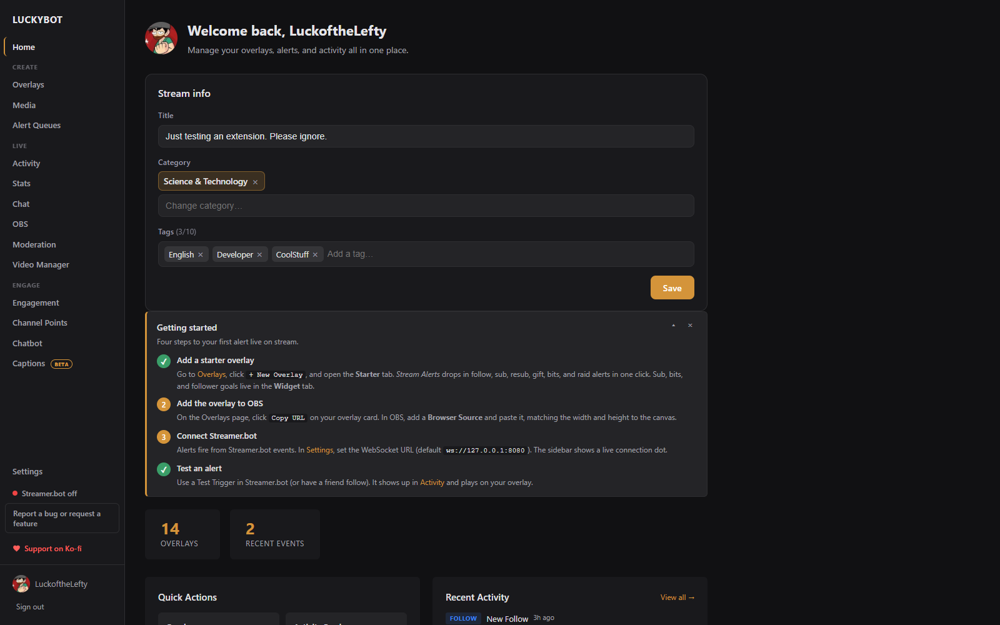

# LuckyBot

A desktop app for Twitch streamers. From a single window it runs alert overlays, a full multi-channel chat client, a native chatbot, subathons, moderation tools, channel points, polls and predictions, OBS control, closed captions, and a clip manager. It runs entirely on your machine with a local server and embedded database, and installs in under 100 MB.

LuckyBot connects to Twitch directly with your login. No Streamer.bot required, though connecting one adds more sources. [LuckyBot Cloud](https://cloud.luckybot.app) can relay Ko-fi, Streamlabs, StreamElements, Fourthwall, and custom WebSocket feeds, and includes a mobile companion for watching chat and events from your phone.

---

## How it works

1. Launch the app. The local server and database start automatically.
2. Log in with Twitch. Events, chat, and channel actions work natively from there.
3. Create an overlay using the drag-and-drop editor, the HTML/CSS/JS code sandbox, a widget, a reactive character, or a ready-made starter.
4. Copy the overlay URL and paste it into OBS as a Browser Source.
5. When an event comes in, the matching alert plays.

Optional: connect Streamer.bot over a local WebSocket, or add a LuckyBot Cloud token in Settings. When multiple sources deliver the same event, LuckyBot fires exactly one alert, preferring Twitch's own feed first, then Streamer.bot, then Cloud.

---

## Features

Overlays
- Drag-and-drop visual editor with layers, shapes, groups, motion paths, attachments, animations, keyframe timelines, and a properties panel
- Reactive overlays: a character with a looping idle animation and a reaction per event
- Full HTML/CSS/JS code sandbox with live preview, configurable fields, a console, and one-click template updates
- Ready-made templates: stream alerts, goal widgets, Spotify now playing, Twitch polls and predictions, subathon timer and goals, closed captions, weather, sound alerts, and more
- Widget overlays that stay on screen and update live: sub, bits, and follower goals, chatbot counters, and every Stats page variable
- Import your StreamElements overlays and AlertBox, media included
- Export overlays as .beacon files, with an option to bundle media; import by drag and drop
- Shared Library for publishing and importing community templates
- A Content Security Policy on every overlay page, with an in-app security notice if a page ever runs script it should not

Alerts
- Multiple alerts per overlay, each bound to one or more event types
- Weighted chance, variants with conditional logic, priority or random selection
- Per-alert duration, queue behavior, chaining, and optional text-to-speech
- Show and hide animations per layer, plus a keyframe animator for full timelines
- Blocking and non-blocking queues with pause, skip, clear, and mute controls, and a floating Deck to fire alerts by hand

Chat
- Full chat client for your channel: badges, emotes, cheermotes, replies, deleted-message handling, translation, and first-time-chatter highlights
- Moderate other channels in tabs, with mod actions, pins, polls, hype train and ad timers per channel
- Shared chat sessions show a participant banner and attribute messages to their source channel
- TikTok LIVE chat and gifts alongside Twitch
- Pop out any chat to its own window, dock it in OBS, or add a styled chat overlay to OBS that restyles live

Chatbot
- Custom commands with variables, cooldowns, permission levels, costs, and counters (deaths, wins, anything)
- Advanced actions: more than thirty steps including conditions, fetches, variables, delays, OBS control, Lumia Stream lights, Spotify, key presses, currency, custom scripts, and sound alerts, from a single command
- Event triggers: commands that fire on subs, raids, cheers, follows, and thon grants
- Counters can be dropped onto an overlay in one click and update live as commands run
- Timed messages with cycling groups and spacing, walk ons, viewer queues, and quotes
- A currency with a shop, watch time tracking, casino games, and a builder for your own session minigames (ghost guessing, raffles, closest number)
- Spotify song requests from chat, with mod controls and a fallback playlist
- Import commands, timers, quotes, counters, and balances from Firebot, StreamElements, Nightbot, Streamlabs Cloudbot, Streamlabs Chatbot, and Mix It Up
- Spam filters and banned words
- Runs from your own account or a separate bot account, server-side, even with the dashboard closed

Thons
- Subathons and point-a-thons run on the server, so OBS reloads and crashes never lose the clock
- Rules per event and tier, happy-hour multipliers, milestone goals, an undo log, and a setup wizard
- Subathon Timer and Thon Goals overlays

Activity feed
- Live feed of events from every connected source, with per-service tabs and filters
- Expand any event to see the full payload; replay past events; run it as an OBS dock
- Customize badge labels, display templates, and colors per event type

Stream tools
- Home page with stream title, category, and tag editing
- Polls, predictions, and channel point reward management with a redemption queue
- Moderation page: unban requests and blocked terms
- Video Manager: create clips from VODs with your stream markers, browse and bulk-download clips
- OBS control: scenes, sources, audio mixer, and streaming status over obs-websocket, plus automatic recovery of LuckyBot browser sources
- Stats page with editable counts, goals, labels, leaderboards, and a choice of how subs are counted
- Closed captions from a fully offline speech-to-text engine

Media library
- Manage images, video, audio, and GIFs locally, with bulk select and delete
- Tracks which alerts use a file before you delete it

Other
- Text-to-speech via ElevenLabs, Amazon Polly, or TTS.Monster
- Spotify now-playing overlay and playback controls
- Connections for Streamer.bot, OBS, Lumia Stream, Spotify, LuckyBot Cloud, StreamElements, TikTok LIVE, and TreatStream
- Embedded database with scheduled backups, self-healing recovery, and a backup before every update
- In-app feedback that goes straight to the developer

---

## Requirements

- Windows 10 or later (64-bit)
- OBS Studio or any software that supports browser sources
- A Twitch account

Optional:
- [Streamer.bot](https://streamer.bot) for YouTube events and anything else your Streamer.bot instance connects to
- A [LuckyBot Cloud](https://cloud.luckybot.app) subscription for cloud-relayed events and the mobile companion

---

## Install

Download the latest installer from the [Releases](https://github.com/luckofthelefty/LuckyBotReleases/releases) page and run it. The app updates itself automatically when new versions come out, taking a database backup first.

---

## Documentation

- [Getting Started](docs/getting-started.md)
- [Overlays](docs/overlays.md)
- [Alerts and Variants](docs/alerts-and-variants.md)
- [Visual Editor](docs/visual-editor.md)
- [Reactive Overlays](docs/reactive-overlays.md)
- [Advanced Editor](docs/advanced-editor.md)
- [Widgets](docs/widgets.md)
- [Chat](docs/chat.md)
- [Chatbot](docs/chat-bot.md)
- [Commands](docs/commands.md)
- [Stream Tools](docs/stream-tools.md)
- [Thons](docs/thons.md)
- [Activity Feed](docs/activity-feed.md)
- [Alert Queues](docs/queues.md)
- [Media Library](docs/media-library.md)
- [Settings](docs/settings.md)

---

## What's New

Recent highlights from the 0.6.3xx releases:

- Subathons and point-a-thons: a server-run timer with rules, multipliers, goals, an undo log, and two overlays.
- Reactive overlays: a character with a looping idle animation and a keyframed reaction per event, with motion paths and layer attachments in the editor.
- Import overlays from StreamElements, and import chatbot setups from Firebot, StreamElements, Nightbot, Streamlabs Cloudbot, Streamlabs Chatbot, and Mix It Up.
- Watch time tracking, a minigame builder, Lumia Stream and key-press steps, and event triggers for the chatbot.
- TikTok LIVE and TreatStream connections, and a restyle-live chat overlay for OBS.
- The Stats page can count only subs announced in chat, and a renewal is never counted twice.
- Overlay pages carry a Content Security Policy against chat-message attacks on OBS browser sources, with an in-app security notice.
- Overlays in OBS unload their media between alerts and are revived automatically if a page crashes, when OBS is connected.

The full changelog lives on the [Releases](https://github.com/luckofthelefty/LuckyBotReleases/releases) page.

---

## License

MIT
