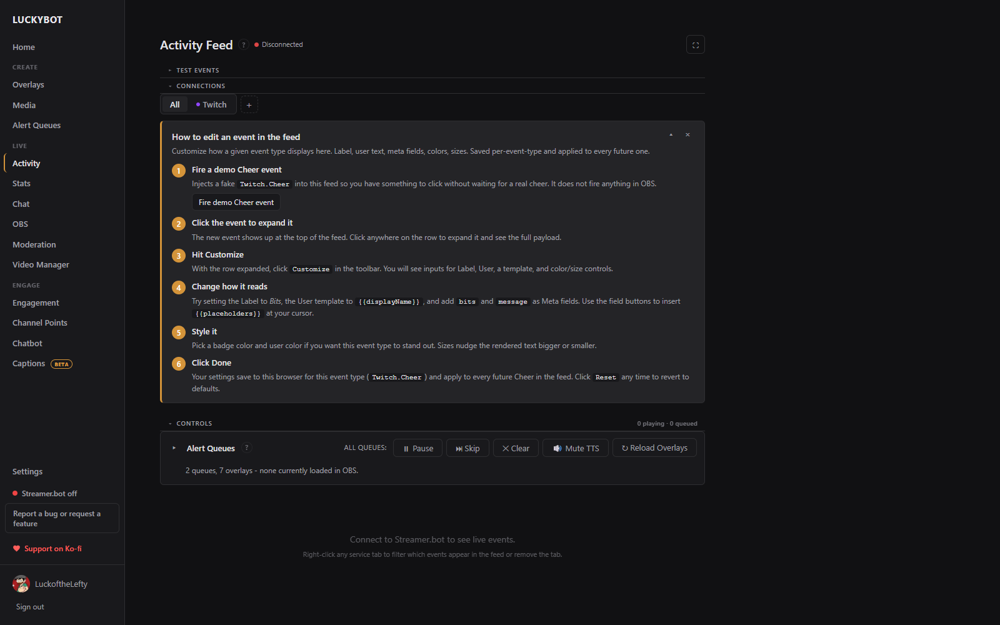

# Activity Feed

The activity feed shows stream events from every connected source in real time. Use it to monitor what is happening, replay events, and check event data when building alert conditions.

---

## Event sources

Events arrive from up to three places:

- **Twitch**: native events from your Twitch login. Always active. TikTok LIVE and TreatStream events arrive here too when those connections are on.
- **Streamer.bot**: optional, over a local WebSocket. Adds YouTube events and anything else your Streamer.bot connects to.
- **LuckyBot Cloud**: optional, via a cloud token. Relays services such as Ko-fi, Streamlabs, StreamElements, Fourthwall, and custom WebSocket feeds.

All can be active at once; duplicate copies of the same event are collapsed automatically. Connections are set up in **Settings > Connections**.

The feed header shows the Streamer.bot connection state, a viewer-count pill (click to show or hide the number), an ad countdown during mid-rolls, a **Pop out** button for a separate window, and a **Copy OBS dock URL** button so the feed can run as a custom browser dock inside OBS. The popout has a **Keep this window on top** option.

---

## The event list

Each row shows the event type as a colored badge, the viewer's name, a summary (tier, months, amount, message), and the arrival time. Click a row to expand the full payload as key/value pairs. Gift bombs fold their individual gifted subs into one row.

**Mark all read** and **Clear history** live at the top of the feed. The feed keeps recent events between app restarts and pages older ones in batches of 200. Right-click a row to **Filter to this event** type temporarily.

---

## Tabs

The tab bar groups events by service (Twitch, YouTube, and so on), plus an **All** tab. Click the **+** button to add or remove service tabs.

Right-click any service tab for:

- **Filter events**: a searchable list of that service's event types. Toggle each on or off, or use select all, deselect all, and reset to defaults. Noisy types like chat messages and viewer-count updates are hidden by default.
- **Remove tab**

---

## Replaying events

Click **Replay** on any event row to send that event through your overlays as if it had just arrived. Overlays evaluate variant conditions and queue matching alerts exactly like a live event.

---

## Customizing event display

Click **Customize** on any expanded event row to change how that event type renders:

- **Label**: override the badge text.
- **User template** and **Meta template**: `{{fieldKey}}` templates for the name and summary columns, with insert buttons for the available fields.
- **Colors and sizes** for the badge, user text, and meta text.

Click **Reset** to remove the customizations for that type. Customizations persist between sessions. A short walkthrough at the top of the page fires a demo Cheer event so you can try it.

---

## Alert queue controls

The **Controls** panel monitors and controls playback without leaving the page. Its header shows how many alerts are playing and queued.

Global controls: **Pause / Resume**, **Skip** (cut the current alert short on every queue), **Clear** (drop every queued alert), **Mute TTS / Unmute TTS**, and **Reload Overlays** (force every connected browser source to reload, which fixes a blank or errored overlay without touching OBS).

Expand the panel for per-queue rows showing the queue name, blocking or non-blocking status, assigned overlays and whether each is currently loaded in OBS, the playing alert, and the waiting count, with the same pause, skip, clear, and mute controls per queue.

Below the controls, live bars appear for hype trains, polls, predictions, and outgoing raids while they are running.
