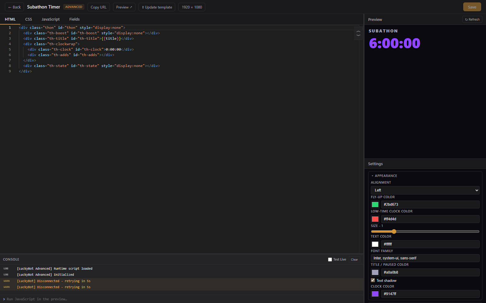
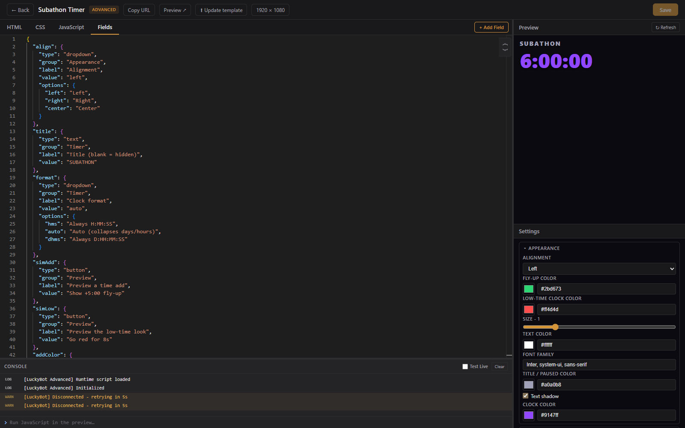

# Advanced Editor

The advanced editor is a full HTML/CSS/JS code sandbox. Use it for overlays that need custom code, or start from one of the built-in advanced templates (Spotify Now Playing, Twitch Polls, Twitch Predictions, Weather, Closed Captions, Sound Alerts, Subathon Timer, Thon Goals, Up Next, Custom WebSocket Feed).



---

## Layout

- **Left**: the code editor with tabs across the top.
- **Right**: a live preview of the overlay, with a **Settings** panel for the overlay's field values under it. Drag the divider to adjust the split.
- **Bottom**: a console panel for debugging. Drag its divider to resize.

---

## Code tabs

- **HTML**: the page markup.
- **CSS**: styles applied to the page.
- **JavaScript**: code that runs in the overlay.
- **Fields**: a JSON schema that defines configurable settings for the overlay.

The live preview updates shortly after you stop typing. Save with the **Save** button or Ctrl+S.

---

## The LUCKYBOT API

When your overlay loads, a `LUCKYBOT` global is injected automatically. `BEACON` is the same object, kept for older code.

```js
// Listen for a specific event
LUCKYBOT.on('Twitch.Follow', (data) => {
  console.log(data.user, 'followed');
});

// Listen for all events
LUCKYBOT.on('*', (type, data) => {
  console.log(type, data);
});
```

Event data is normalized across sources, so fields like `user`, `displayName`, `userId`, `amount`, and `tier` are consistent whether the event came from Twitch directly, Streamer.bot, or LuckyBot Cloud. Events arrive from the app's own Twitch connection first, then Streamer.bot, then Cloud, and duplicates of the same event are dropped.

Beyond events:

- `LUCKYBOT.fieldData`: the current values of your Fields.
- `LUCKYBOT.stats`: the live stats variables (session, totals, aggregates, labels, goals), updated by pushes. `LUCKYBOT.on('stats', ...)` fires on each update.
- `LUCKYBOT.store.get(key)` and `LUCKYBOT.store.set(key, value)`: a persistent key-value store shared by every overlay in your workspace. Writes reach the other overlays as a `kvstoreUpdate` event.
- `LUCKYBOT.sendChat(message)`: posts to your Twitch chat, limited to 60 lines a minute per overlay.
- `LUCKYBOT.chat(handler)`: raw chat messages as they arrive; call `.close()` on the returned stream to stop.
- `LUCKYBOT.currency.list()`, `.balance(viewer)`, `.add(viewer, amount)`, `.charge(viewer, amount)`, `.adjust(viewer, amount)`: read and move chatbot currency from an overlay, for games that pay out or charge an entry fee. `viewer` is a login, a numeric id, or a chat message.
- `LUCKYBOT.on('fieldButton', d => ...)`: fires when a Button field is clicked in the Settings panel (`d.field` is the field key).

---

## Snippets

**Code Snippets** in the top bar opens ready-to-use examples. Click any snippet to insert it at the cursor. Snippets cover event listeners, paying or charging a viewer, show and hide helpers, CSS animations, countdowns, and HTML structures such as an alert card and a progress bar.

---

## Fields

The Fields tab defines settings that appear as form controls on the overlay's Settings panel, so things stay configurable without editing code. Use **+ Add Field** to build a field without writing JSON.



Supported field types:

| Type | Description |
|------|-------------|
| Text | Single-line text input |
| Textarea | Multi-line text input |
| Number | Number input (min, max, step) |
| Slider | Range slider |
| Checkbox | Boolean toggle |
| Color | Color swatch and hex input |
| Dropdown | Select from a list of options |
| Audio | Audio file from the media library, with volume, speed, pitch, start, and duration |
| File | File path or media pick (image and video variants exist too) |
| Button | A button that sends a `fieldButton` event to the overlay |
| Hidden | Stored value readable from JavaScript, not shown |

Fields can be grouped into collapsible sections with the `group` property. In your HTML and CSS, `{{fieldKey}}` references a field's value and is replaced when the overlay renders.

---

## Template updates

Overlays created from a built-in template remember which one. When a LuckyBot update improves that template, an **Update template** button appears in the editor. Clicking it replaces the overlay's code with the latest version while keeping your field values. Manual code edits are overwritten, so skip the update if you have customized the code.

---

## Console

The console panel captures `console.log`, `console.error`, and other output from the preview, with an error count in its header. Type expressions into the console input to run them against the live preview. Check **Test Live** to also run typed snippets in every connected browser source, which is useful for debugging the overlay as it runs in OBS.

Uncaught errors and `console.error` lines from the live pages in OBS are also written to the app's server log, so they end up in a bug report bundle.

---

## Canvas size

Use the canvas size control in the top bar to pick a preset or enter custom dimensions. Changes apply immediately.
