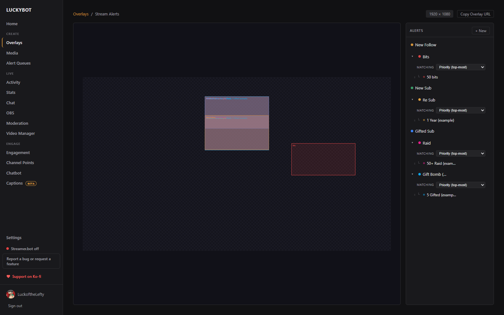
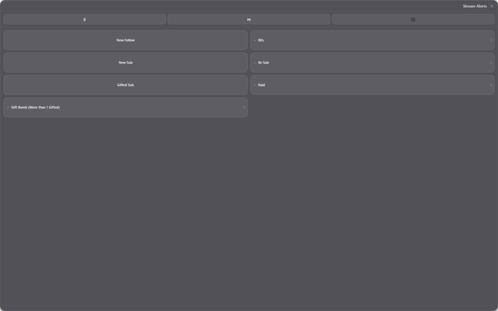

# Alerts and Variants

---

## Alerts

An alert is a canvas animation that plays when a specific event fires. Each overlay can have multiple alerts.

Clicking an overlay card opens this page: a preview of every alert's layers on the left, and the alert list on the right. Static overlays list canvases here instead, and widget overlays list widget canvases.

### Creating an alert

Click **+ New**, type a name, and press Enter. The alert editor opens.

The collapsible **Alert Settings** panel on the left has three tabs:

- **Event**: which events trigger the alert, plus filters and queue behavior.
- **Duration**: how long the alert holds on screen, in milliseconds.
- **TTS**: optional text-to-speech for this alert.

Then build the alert on the canvas. See [Visual Editor](visual-editor.md).

### Choosing events

Click **Choose events** in the Event tab to open the event picker. It has three tabs: **Twitch** (native events from your login, plus TikTok and TreatStream when connected), **Streamer.bot**, and **Cloud** (locked until a LuckyBot Cloud token is configured). An alert can respond to any number of event types.

Extra filters appear for certain events:

- **Command filter**: for chat command events, only fire for a specific command.
- **Reward filter**: for channel point events, only fire for specific rewards.
- **Only fire when**: a condition that gates the whole alert, using the same condition builder as variants.

### Queue behavior

When the overlay is assigned to a blocking queue, each alert picks how it joins:

- **Queue**: waits its turn.
- **Skip Queue**: plays immediately alongside whatever else is playing.
- **Skip if Busy**: plays only if nothing else is playing, otherwise it is dropped.
- **Replace Same**: replaces a queued alert of the same type instead of stacking up.

### Chaining

**Chain to Alert** plays another alert automatically when this one finishes. Use it for multi-part sequences.

### Enabling, chance, renaming

- Each alert has an enable toggle in the list. Disabled alerts never play.
- Each alert has a chance percentage. When multiple alerts are bound to the same event, LuckyBot picks one based on these weights.
- Rename with the pencil icon, or right-click an alert row for rename, add variant, and delete options. Deletions can be undone for a few seconds from the notification.

---

## Variants

Variants play a different version of an alert based on conditions: a special animation for Tier 3 subs, a bigger alert for raids over 100 viewers, and so on.

Each variant has its own canvas layout, duration, and condition rules. The parent alert is the default when no variant matches.

### Creating a variant

Right-click an alert row and choose **+ New Variant**, or use **Duplicate & Edit** on an existing variant to copy its canvas and conditions.

### Variant conditions

Click **Variant Setup** in the top bar of the variant editor.

- **Simple view**: one condition per row, all joined with AND. Quick-condition chips cover common cases like sub tiers.
- **Advanced view**: condition groups with AND and OR logic, nestable, with a Wrap Selected action for grouping existing rules.

A condition has a field name, an operator (`==`, `!=`, `>`, `>=`, `<`, `<=`), and a value. A variables panel lists known fields from live events; the [Activity Feed](activity-feed.md) shows the full payload of any real event.

A variant with no conditions matches every event of the parent type.

### Match mode

When an alert has variants, the **Matching** dropdown on the alert row picks how ties are resolved:

- **Priority (top-most)**: the first matching variant in list order wins. Drag variants to reorder.
- **Random among matches**: picks randomly from all matching variants.

Variants also have their own chance percentage, and can be enabled or disabled individually from their right-click menu.

---

## Testing

The editor's **Test** button plays the alert with sample data in the preview. Its arrow menu offers **Test with custom data**, where you edit the event payload first, and **Also fire on live overlays**, which sends the test to every connected browser source including OBS.

You can also fire test events for any source from the [Activity Feed](activity-feed.md), which exercises event matching and queues exactly like a real event.

---

## The Deck

**Popout Deck** in the alert list header (desktop app) opens a small always-on-top window with one button per alert. Click a button to fire that alert with the last real event's data for its type, for example to replay a follow alert on demand. Alerts with variants open a folder view with the base alert and each variant.

The bar at the top pauses, skips, or clears the overlay's queue. Right-click an alert for **Replay (Edit)**, which opens the custom-data test, or to enable and disable it. Right-click empty space to set the window's transparency. The window remembers its position per overlay.

---

## Text-to-speech

Each alert and variant configures TTS independently, in the **TTS** tab of the Alert Settings panel:

- Enable TTS for this alert.
- Message template with insertable `{{variable}}` chips (for example `{{user}} just followed!`).
- Volume (0 to 100) and delay in milliseconds.
- Voice override, if you want a different voice than the default.

The provider and default voice are configured in **Settings > Audio**. See [Settings](settings.md).
