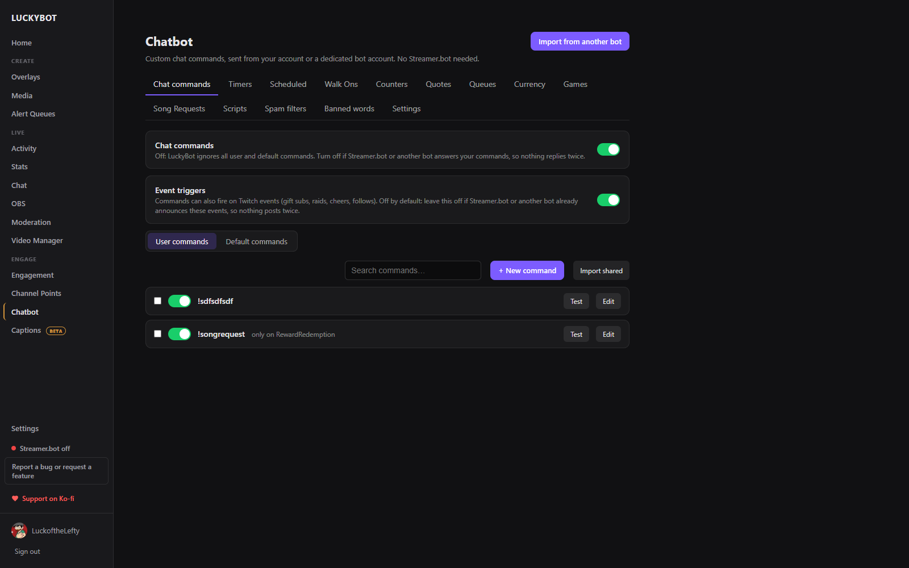
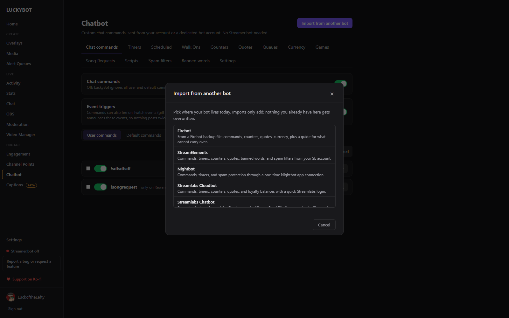
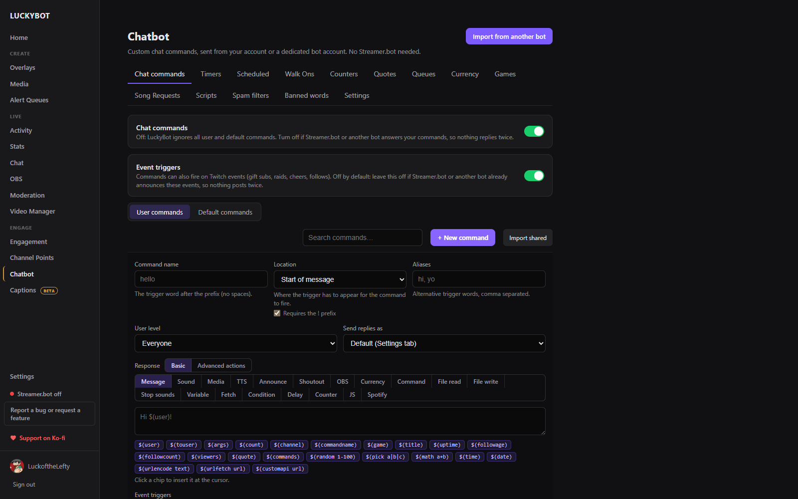
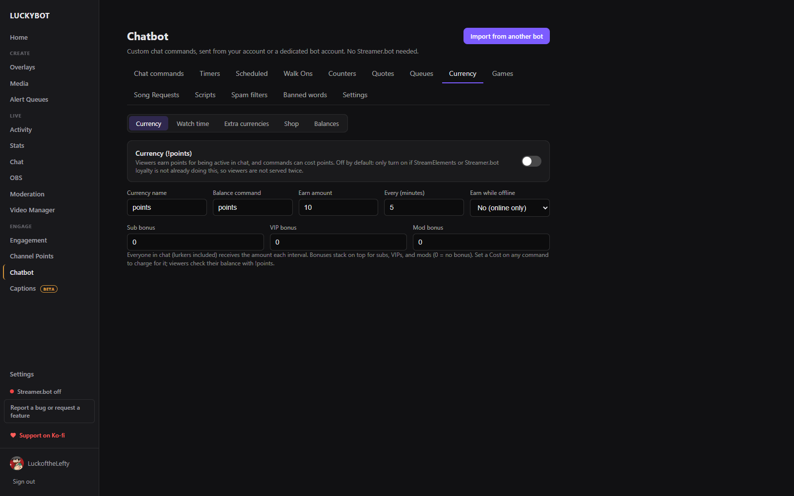
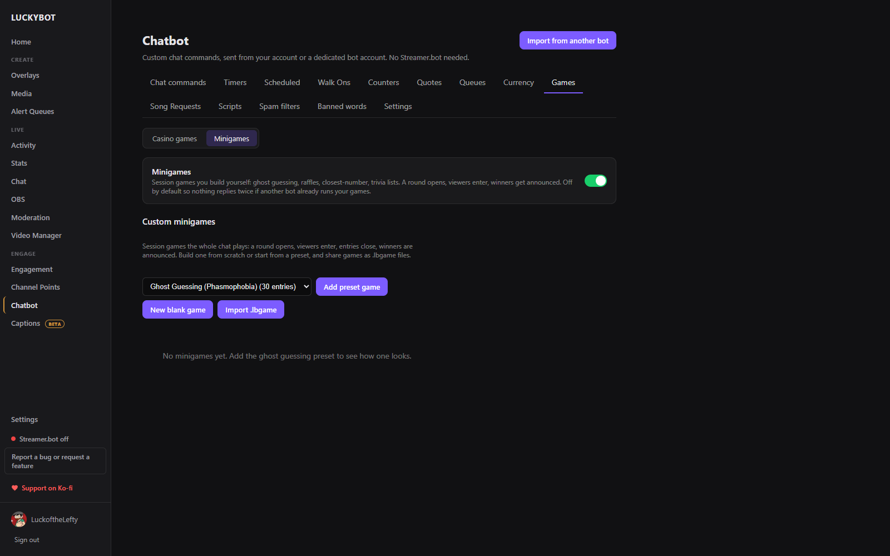

# Chatbot

LuckyBot has a built-in chatbot: custom commands, timers, walk ons, counters, quotes, viewer queues, a currency with a shop and watch time, chat games and custom minigames, Spotify song requests, custom scripts, spam filters, and banned words. It runs server-side from your account or a dedicated bot account, works with no other software, and keeps running with the dashboard closed.

The Chatbot page has fourteen tabs: **Chat commands**, **Timers**, **Scheduled**, **Walk Ons**, **Counters**, **Quotes**, **Queues**, **Currency**, **Games**, **Song Requests**, **Scripts**, **Spam filters**, **Banned words**, and **Settings**. Features that another bot commonly handles (event triggers, walk ons, currency, games, minigames, banned words) start off, so nothing replies twice next to Streamer.bot or StreamElements.

---

## Import from another bot

**Import from another bot** at the top of the page brings your existing setup over. Imports only add; nothing you already have gets overwritten, and re-importing never duplicates.

| Bot | What you provide | What comes over |
|---|---|---|
| **Firebot** | A Firebot v5 backup .zip (Settings > Backups > Backup Now) | Commands, channel point rewards, event commands, timers, counters, extra currencies, quotes, banned words, currency balances. Media copies in automatically when you import on the PC that runs Firebot. |
| **StreamElements** | Nothing extra: it uses the StreamElements connection from Settings, or a pasted command share link | Commands and timers with their access levels, cooldowns, online/offline state, and costs; counters, quotes, banned words, spam filter settings. |
| **Nightbot** | A one-time Nightbot app authorization (Client ID and Secret from nightbot.tv) | Commands and timers with user levels, cooldowns, and usage counts; the blacklist as banned words; spam filter settings. |
| **Streamlabs Cloudbot** | A one-time Streamlabs login inside the app (never saved) | Commands and timers with permissions, cooldowns, and costs; counters, quotes, loyalty balances. |
| **Streamlabs Chatbot** (desktop) | A .zip of its "Create Excel Files" export | Commands, timers, quotes with game and date, currency balances. Command groups are not in the export unless you add a Group column first. |
| **Mix It Up** | A .miubackup file (Settings > Backup) | Commands, event commands, timers, counters, quotes, banned words, currency balances, extra currencies and inventories, and overlay alerts recreated as a LuckyBot overlay. |

Each importer shows what it will bring, what it has to skip, and lets you tick individual items. Balances are never lowered. Reward and event commands need **Event triggers** turned on to fire.

**Import shared** (on the Chat commands and Timers toolbars) imports a share file another LuckyBot user exported. Select commands or timers and use **Export to file** to make one. Sound and media files ride along in the file (up to 10 MB each), counters travel by name, and name clashes can be imported renamed.

---

## Chat commands

Commands live under two sub-tabs: **User commands** (yours) and **Default commands** (built-ins you can toggle and edit).

Two switches sit above the list. **Chat commands** turns the whole bot on and off. **Event triggers** lets commands fire on Twitch events (gift subs, raids, cheers, follows, and more) instead of typed text; it is off by default.

Each command has:

- A name and optional aliases.
- A **Location**: the trigger word at the start of the message, an exact match, anywhere in the message, or a regular expression.
- A **user level**: Everyone, Subscriber, VIP, Moderator, or Broadcaster.
- **User** and **global cooldowns** in seconds.
- A stream state: fire when online, offline, or both.
- A **cost** in currency, if Currency is on.
- A **response**: **Basic** (a message with insertable `$(variables)`, a sound, media, TTS, an announcement, a shoutout, an OBS action, and so on) or **Advanced actions**, a step builder that runs top to bottom.

See [Commands](commands.md) for the full list of variables and every step, with examples.

---

## Timers

Timed messages that post on an interval: a name, one or more messages, and separate intervals for when you are live and offline. Messages support the same `$(...)` variables.

Timers can cycle as a **group**: one member posts per interval, in order or shuffled, instead of every timer firing at once. **Timer spacing** sets a minimum gap between any two timer posts, so timers that share a cadence take turns rather than stampeding chat.

---

## Scheduled

When a command hits a Delay step of 60 seconds or more, the rest of its steps are parked here and run when due, keeping the original trigger context like `$(user)`. Scheduled steps survive app restarts, updates, and reboots. Cancel anything that should not fire, or refresh the list to see what is currently waiting.

---

## Walk Ons

A walk on runs once per viewer per stream, the first time they chat since you went live (not their first message ever). Target one viewer by name, a role like VIPs, a minimum sub tier, or everyone. Steps can do anything a command can: chat a message, run a Twitch shoutout, play a sound or media on an overlay, TTS, and more.

Off by default: leave it off if Streamer.bot or another tool already does walk ons, so nothing fires twice.

Use **Preview a viewer's arrival** to check which walk on would fire for a real viewer without anything actually running, and **Reset arrivals** to forget who has already chatted this stream so you can re-test without going live again.

---

## Counters

Counters are named tallies driven from chat: deaths, wins, anything. Presets cover common setups, or build a custom one.

Each counter has up to three bound commands: **view**, **increment**, and **decrement** (for example `!deaths`, `!death`, `!unkill`), each with its own permission level and response using `$(count)`.

**Create overlay** builds a ready-made widget overlay showing the counter, updating live the moment a command runs. Once one exists the button becomes **Open overlay**. Counters are also available to any widget as `{{counter_name}}` variables. See [Widgets](widgets.md).

---

## Quotes

A quote list with search. Add quotes from the page or from chat with `!quote add`. Each quote records its number, the game, who added it, and the date. `$(quote)` pulls a random one into any response.

---

## Queues

Viewers line up for something (a coaching slot, a 1v1, a giveaway spot) with a chat command, optionally adding a note. This is separate from [Alert Queues](queues.md), which control alert playback timing.

Each queue gets its own command word. Viewers join with `!word` (anything typed after it becomes their note), check their spot with `!word pos`, and leave with `!word leave`. `!word list` shows the front of the line. Mods use `open`, `close`, `next`, `remove`, and `clear`.

Commands and walk ons can control queues with the Viewer queue step, and `$(queue:word)` / `$(queuenext:word)` work in any response.

Click a queue's row to see who is in line without opening Edit; the row updates live.

---

## Currency

Viewers earn points for being active in chat, and commands can cost points. Off by default: only turn it on if StreamElements or Streamer.bot loyalty is not already doing this, so viewers are not served twice.

Set a currency name, a balance command (`!points` by default), how much viewers earn and how often, whether earning happens while you are offline, and bonus amounts for subs, VIPs, and mods. Everyone in chat, lurkers included, earns each interval; bonuses stack on top. Set a **Cost** on any command to charge for it. Advanced overlays can read and move currency too, for games that pay out.

### Watch time

Counts the minutes each viewer is present, lurkers included. On by default; totals already recorded are kept if you turn it off. Choose whether to count while offline, and list bot accounts to leave out so they do not sit at the top of the board. You are never counted.

Use `$(watchtime)` in a command reply for "20 hours and 34 minutes", `$(watchtimeuser)` for the person the command names, or `$(watchminutes)` for the raw number. The leaderboard on this tab is searchable and every value is editable, and **Import watch time from another bot** takes a JSON or CSV export keyed by Twitch user ID, either adding to or overwriting existing totals.

### Extra currencies

Named ledgers alongside your main currency (tickets, raffle entries, event coins). Give one its own balance command and, if you like, let it auto-earn from chat just like the main currency. Use `$(points:slug)` in any command reply to show a balance.

### Shop

Viewers spend currency on items, which can grant another currency (buy raffle tickets with points). Off by default. Viewers type `!buy <item> [amount]`; the reply supports `$(item)`, `$(qty)`, and `$(total)`.

### Balances

Search and edit individual viewer balances for the main currency or any extra currency, and bulk-delete a currency's balances if needed.

---

## Games

### Casino games

Chat games played with your currency: **Slots** (three reels, pairs pay a little, triples pay big), **Roulette** (double or nothing on a configurable win chance), and **Heist** (a join window opens, the crew rolls together, survivors multiply their bet). Off by default: turn on only if another bot is not already running chat games, so nothing replies twice.

Bets come out before the roll and wins pay back in, so the house edge is whatever the odds say. Viewers can bet a number or "all". Solo games have a per-viewer cooldown to keep chat readable. Requires Currency to be turned on.

### Minigames

Session games you build yourself: ghost guessing, raffles, closest-number, trivia lists. A round opens, viewers enter, entries close, winners are announced. Off by default.

Start from a preset (**Ghost Guessing** for Phasmophobia or The Other Side, **Closest Number**, **Raffle**) or a blank game, and share games as `.lbgame` files. Each game defines:

- **Basics**: what viewers submit (a pick from a list, a number in a range, free text, or just joining), whether they can change their entry, how a round resolves (a mod announces the answer, a random draw, or closest number wins), auto-close and entry caps, lifetime win tracking, and an optional currency payout per winner.
- **Lists**: the options for pick games, one per line with optional aliases.
- **Commands**: the words for starting a round, entering, closing entries, resolving, cancelling, showing top winners, and showing the options. Mod-only actions stay mod-only automatically.
- **Messages**: every bot reply, with `$(user)`, `$(entry)`, `$(answer)`, `$(winners)`, `$(entrycount)`, and more.

The game card runs a round from the dashboard too: **Start round**, **Close entries**, type the answer and **Resolve**, or **Cancel round**, with a live count of entries.

---

## Song Requests

Viewers request Spotify tracks from chat, and LuckyBot manages the request queue against your Spotify account. Requires a Spotify Premium account connected under Settings > Connections.

Viewers use `!sr <song name or Spotify URL>` to request a song. Requests are sent straight into Spotify's queue as soon as they are accepted. Mods manage the queue with `!srpause`, `!srenable`, `!srskip`, and `!srclear`.

Settings:

- **Enable song requests** / **Pause requests** (pause keeps the existing queue playing but refuses new requests).
- **Max requests per viewer**, **allow duplicate tracks**, and a **per-viewer cooldown**.
- **Who can request songs**: a minimum user level.
- **Fallback playlist**: a Spotify playlist link or URI that plays automatically once the request queue runs dry.
- **Playback device**: which Spotify Connect device requests play on. Leave it on Auto and Spotify may choose the wrong device if more than one is reachable.

The tab lists every request with its status (Pending, Queued in Spotify, Playing, Played, Skipped, or Failed), and lets you search, **Play now**, **Requeue**, **Remove**, or open a track in Spotify.

---

## Scripts

Run your own Python scripts as part of the bot. **Action step** scripts run once from a "Run custom script" command step: your arguments arrive on the command line, the trigger context arrives as JSON on stdin, and whatever they print becomes a variable for later steps. **Event** scripts stay running, see every chat line and Twitch event as JSON lines on stdin, and act by printing JSON lines back (say, announce, timeout, ban, play a sound).

Streamlabs Chatbot script packages are detected on upload and run as-is under a compatibility harness, with their settings panel rendered on the page. Scripts run unsandboxed with your full user permissions, so only run scripts you trust.

Set the full path to `python.exe` and click **Test**, then upload a script as a `.zip` (recommended, so everything in its folder comes along) or as loose files. Each script has a log and an error view.

---

## Spam filters

A master toggle with sensitivity presets (Off, Minimum, Medium, Maximum) and individual filters: Caps, Symbols, Paragraph (walls of text), Emotes, Repetition, Zalgo, Links (with allowed domains), and One-man spam. Each filter has its own thresholds, an action (delete, timeout, or ban), an optional warning message, and can exempt subscribers or VIPs. Moderators and the broadcaster are always exempt. Actions run from your bot account when you reply as the bot (make it a moderator), otherwise from you.

---

## Banned words

Patterns that trigger an automatic action when they appear in chat. Each pattern matches as a whole word, a phrase, a wildcard, or a regular expression, with a delete, timeout, or ban action. **Import CSV** takes one word or phrase per line, with optional columns for match type, action, and duration. Off by default if another bot or AutoMod handles this.

---

## Settings

- **Chat bot enabled**: the master switch.
- **Command prefix**: the character commands start with (default `!`).
- **Bot account**: connect a dedicated bot account with a device code: open the shown link in a browser signed in as the bot account and enter the code. Make the bot a moderator in your channel; it raises rate limits and lets the bot run spam filter and banned word actions itself. **Send replies as** then picks your account or the bot account.
- **When Streamer.bot is also running**: prefer Streamer.bot and only answer commands it does not have (recommended), pause LuckyBot while Streamer.bot is running, or prefer LuckyBot and answer everything.

Messages the bot sends itself never trigger its own commands, so a reply cannot loop.
