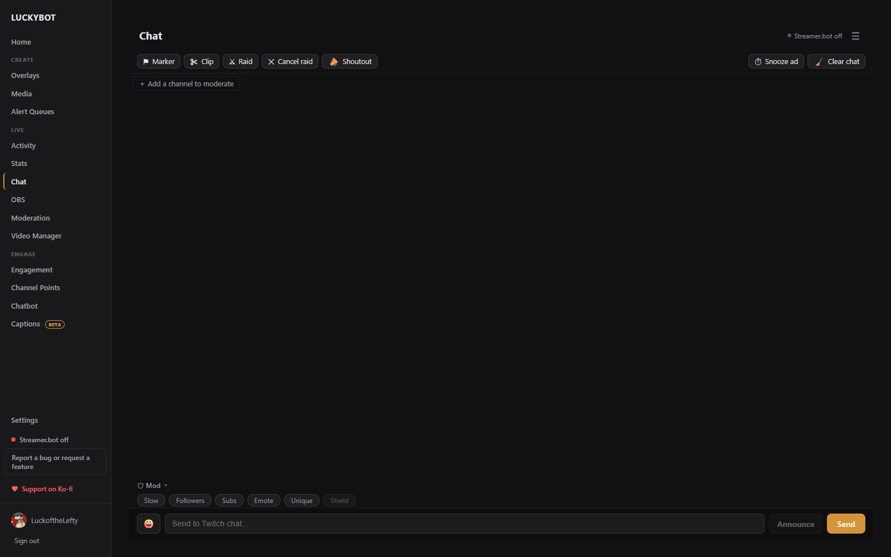
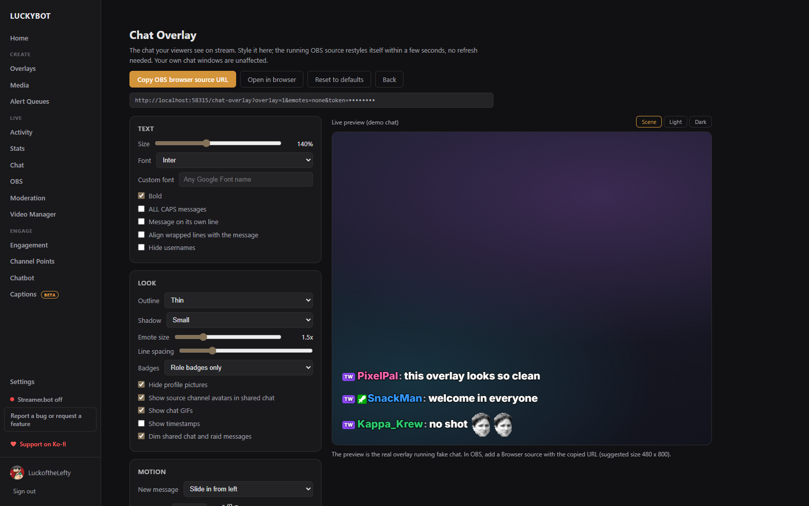

# Chat

The Chat page is a full Twitch chat client: read and send chat, run moderation, and manage other channels you moderate, all inside LuckyBot. It works natively from your Twitch login.

---

## The chat view

Messages show badges, emotes (including BetterTTV, FrankerFaceZ, and 7TV), animated cheermotes, replies, and pronouns. First-time chatters and first messages of the stream can be highlighted, @-mentions of you can be colored, and non-English messages can show an English translation underneath.

Power-Up message effects and gigantified emotes render like native Twitch. Deleted and banned messages are struck through or removed, based on your setting.

Hover a message for quick actions: copy, reply, pin, shoutout, and moderation actions. Click a username for the viewer card, which shows their history in your chat and their watch time.

During a shared chat session, a banner at the top shows the participating channels, and messages from other channels are tagged and shown with the source streamer's picture. With TikTok LIVE connected, TikTok chat appears in the same view tagged TT.

Event cards for subs, gifts, bits, raids, follows, channel points, watch streaks, and mod anniversaries appear inline. Repeated TikTok "shared the stream" cards collapse into one card with a count.

---

## Toolbar

Above the chat: **Marker** (drop a stream marker), **Clip** (create a clip), **Raid** and **Cancel raid**, **Shoutout**, the next ad countdown with a **Snooze ad** button, **Clear chat**, and the chat settings menu.

A collapsible **Mod** strip toggles Slow, Followers-only, Subs-only, Emote-only, and Unique-chat modes, plus Shield mode.

While a raid is outgoing, a bar shows the target, the live count of viewers ready, and a countdown, with a Cancel button. Live bars for hype trains, polls, predictions, and ads appear the same way.

---

## Sending

Type in the compose bar and press Enter. An emote picker, @-mention autocomplete, and :emote: autocomplete are built in. **Announce** sends the message as a Twitch announcement.

Slash commands are supported: `/ban`, `/unban`, `/timeout`, `/untimeout`, `/purge`, `/shoutout` (`/so`), `/clear`, `/raid`, `/unraid`, `/marker`, `/announce` (with color variants), `/slow`, `/followers`, `/subscribers`, `/emoteonly`, `/uniquechat` (each with an off variant), `/me`, `/commercial`, and `/help`. If a slash command fails (for example an ad on cooldown), the reason shows to you in chat instead of being posted to Twitch.

Messages can be sent from your account, or from a bot account via the Sending tab in chat settings.

---

## Moderating other channels

The tab bar holds your own channel plus any channels you moderate. Click **Add a channel to moderate** to pick from channels where you are a moderator.

Each moderated tab is a full chat view with mod actions, pinned messages, channel point redemptions, polls, hype train and ad timers, and event cards (subs, gifts, raids) for that channel. Shared chat is attributed there too. Tabs drag to reorder, and each has a popout button and a remove button.

---

## Popouts and OBS

- Any chat tab can pop out to its own window, and popouts can be set to open at startup per channel.
- **Chat settings > Popouts & Overlays** has an **OBS chat dock URL** you can add in OBS as a Custom Browser Dock, so chat lives inside OBS.
- The same tab links to the **Chat Overlay** page for showing chat on stream. See below.

---

## Chat overlay for OBS

The Chat Overlay page (Chat settings > Popouts & Overlays > Chat overlay) styles the chat your viewers see on stream. The running OBS source restyles itself within a few seconds of any change, no refresh needed, and your own chat windows are unaffected.

- **Text**: size, font (a list of Google Fonts or any custom Google Font name), bold, all caps, message on its own line, hide usernames.
- **Look**: outline and shadow strength, emote size, line spacing, which badges show, profile pictures, shared chat avatars, chat GIFs, timestamps, and dimming of shared chat and raid messages.
- **Motion**: the new-message animation (slide, fade, pop), hide after N seconds, newest at the top or bottom, and a transparent, dimmed, or dark background.
- **Filters**: hide known chat bots, hide `!commands`, and hide specific users. Event cards follow the Events tab of your chat settings.

The live preview is the real overlay running a demo chat. Click **Copy OBS browser source URL** and add it in OBS as a Browser Source; 480 x 800 is a good starting size.

### More than one chat overlay

Different scenes can use different fonts and looks. The **Editing overlay** bar at the top of the page lists your chat overlays, starting with **Default**. Click **New overlay**, give it a name (for example "Just Chatting scene"), and it starts as a copy of the overlay you were editing. Every overlay has its own OBS URL: pick it in the bar, style it, then **Copy OBS browser source URL** and paste that into the browser source for that scene. Rename and Delete apply to named overlays; Default always exists, and any overlay URL copied before this feature existed keeps showing the Default style. Event cards and the Events tab filters are shared by all overlays.

---

## Chat settings

The settings menu has five tabs:

- **Display**: emote extensions, text size, badges, pronouns, timestamps, translation, first-time and mention highlights, trusted links.
- **Events**: which event cards appear in chat per channel (Subs / Gifts, Bits / Cheers, Raids, Follows, Announcements, Super Chats, Channel Points, Other) and their colors, plus an option to expand gift-sub recipients into individual lines.
- **Moderation**: whether deleted messages are struck through or removed entirely.
- **Sending**: send as your account or a bot account.
- **Popouts & Overlays**: popout windows, startup auto-open per channel, the OBS dock URL, the Chat Overlay page, and a chat connection reset.
