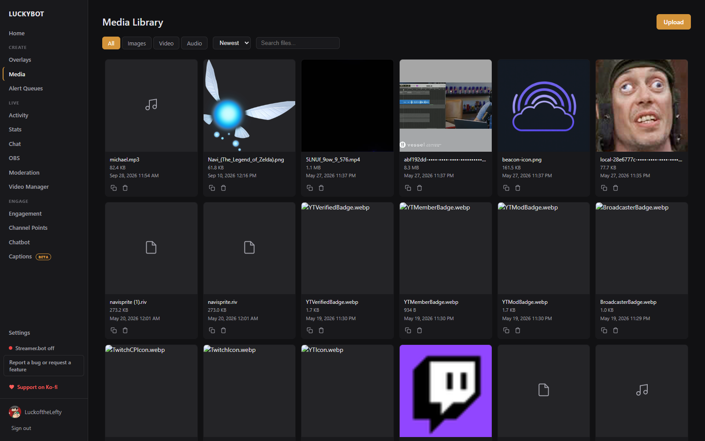

# Media Library

The media library is where you manage the images, videos, GIFs, and audio files used in your alerts and overlays.

---

## Adding files

Click **Add Files** to open a file picker, or drag and drop files directly onto the library grid. Files are stored by the local server, so overlays can load them in OBS.

---

## Browsing the library

Use the toolbar to filter and sort:

- **Type filter**: All, Images, Video, or Audio.
- **Sort**: Newest, Oldest, Name, or Size. The choice is remembered.
- **Search**: filter by file name.

Each card shows a preview and the file size, with **Copy URL** and **Delete** buttons.

---

## Using files in alerts

When editing an image, video, GIF, or audio layer in the visual editor, click the media picker button to browse the library and select a file. The URL fills in automatically. Sound steps in the chatbot and audio fields in advanced overlays use the same picker.

---

## Copying a file URL

Each file card has a copy button that puts the file URL on the clipboard, for pasting into any URL field.

---

## Deleting files

Click the trash icon on a file card. LuckyBot checks whether the file is referenced by any alerts and shows the list before the deletion goes through. If the file is in use, you can still delete it, but the alerts referencing it will show a broken reference. An **Undo** button appears in the notification for a few seconds.

To clean up many files at once, tick the checkbox on each card (Shift-click selects a range), or use **Select all**, then **Delete selected**. The confirmation says how many of the chosen files are still used by alerts. Bulk deletes are immediate and cannot be undone.
