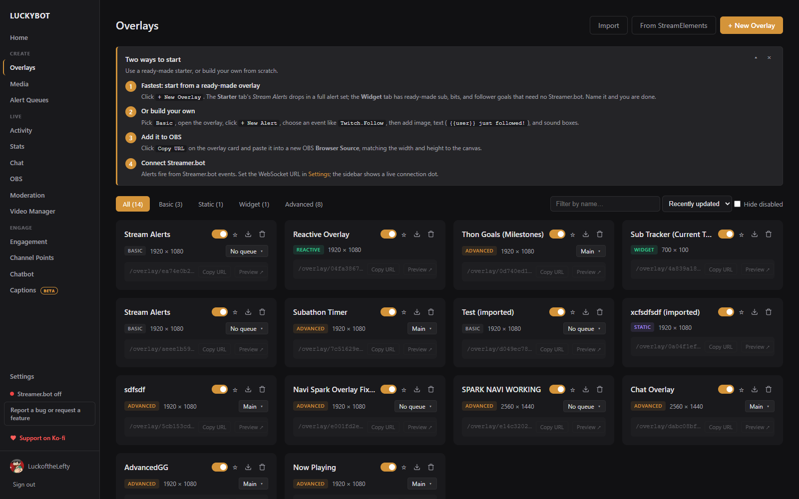
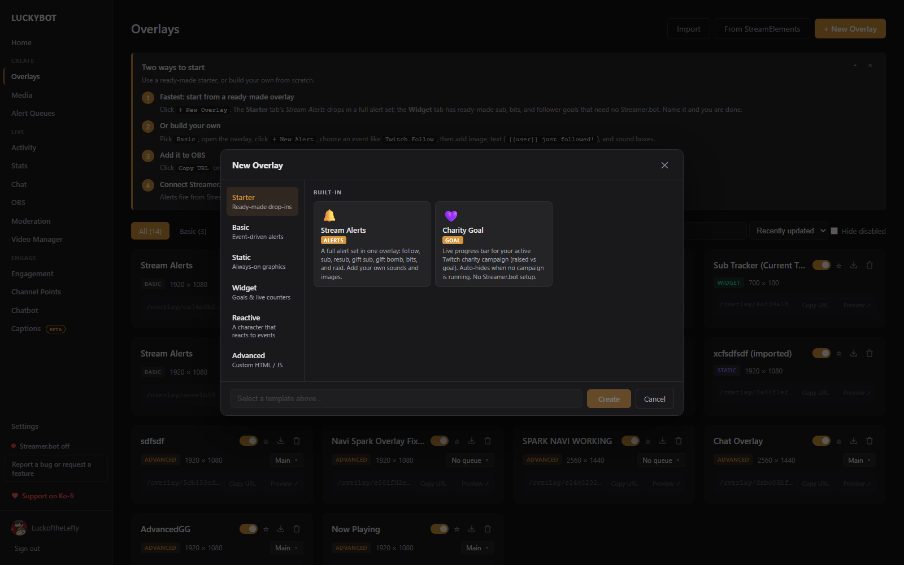
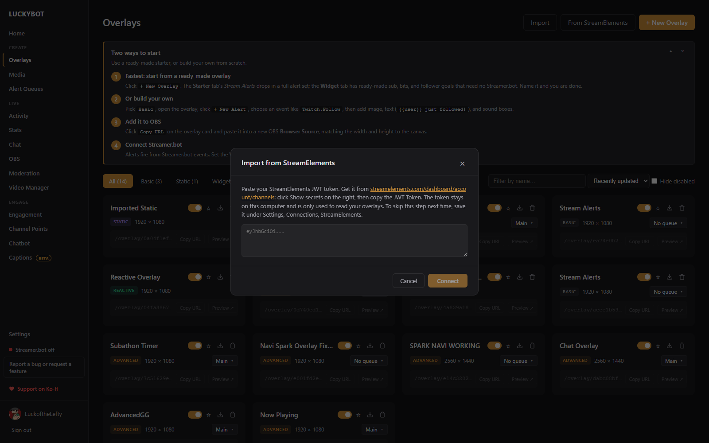

# Overlays

An overlay is a browser page that runs inside OBS as a Browser Source. Each overlay has its own URL, its own content, and its own canvas size.




## Creating an overlay

Go to **Overlays** in the sidebar and click **+ New Overlay**. The template browser opens with six tabs:



- **Starter**: ready-made drop-ins. Stream Alerts is a full alert set (follow, sub, resub, gift sub, gift bomb, bits, raid); Charity Goal tracks a live Twitch charity campaign.
- **Basic**: event-driven alerts built in the drag-and-drop visual editor.
- **Static**: an always-on canvas for persistent graphics.
- **Widget**: always-on goals and live counters: follower, sub, and bits goals plus a multi-goal stack, all working with no other software. See [Widgets](widgets.md).
- **Reactive**: a character that reacts to events. An idle animation loops, and each event you add gets its own animation. See [Reactive Overlays](reactive-overlays.md).
- **Advanced**: the HTML/CSS/JS code sandbox, with templates like Spotify Now Playing, Twitch Polls, Twitch Predictions, Weather, Closed Captions, Sound Alerts, Subathon Timer, Thon Goals, Up Next (Queue), and a Custom WebSocket Feed.

Each tab also shows a **Shared Library** section with community templates. Pick a template, give the overlay a name, and click **Create**.

---

## Overlay types

### Basic

Basic overlays use the visual alert editor. You add alerts to the overlay, each alert has layers (text, image, video, GIF, audio, shapes), and each layer has animation settings. See [Visual Editor](visual-editor.md).

### Static

A static overlay is a single always-on canvas built in the same visual editor, without alert events. Use it for frames, badges, and other persistent graphics.

### Widget

Widgets stay on screen and update live: goal bars, counters, and any Stats page number. See [Widgets](widgets.md).

### Reactive

A reactive overlay is an always-on canvas with a looping idle animation and one extra animation per event. A mascot that waves on a follow and jumps on a raid, for example. See [Reactive Overlays](reactive-overlays.md).

### Advanced

Advanced overlays give you a full code editor with HTML, CSS, JavaScript, and Fields tabs, plus a live preview. The `LUCKYBOT` JavaScript API is injected automatically (`BEACON` still works as an alias for older code):

```js
LUCKYBOT.on('Twitch.Follow', (data) => {
  // data contains the event payload
});
```

See [Advanced Editor](advanced-editor.md) for details.

---

## Managing overlays

The filter chips (All, Basic, Static, Widget, Advanced) narrow the list by type. Reactive overlays appear under All. Use the name filter, the sort (Recently updated or Name A-Z), and **Hide disabled** to tidy a long list. These choices are remembered.

Each overlay card shows the name, a type badge, the canvas size, and the overlay URL. Double-click the name to rename it inline. From the card you can:

- **Enable or disable** the overlay with the toggle. Disabled overlays serve a blank page and never play alerts.
- **Assign a queue** using the queue dropdown (basic and advanced overlays only). See [Alert Queues](queues.md).
- **Copy URL** for OBS, or **Preview** the overlay in a new browser tab.
- **Export** the overlay with the download icon.
- **Delete** the overlay with the trash icon.

Click a card to open the overlay's alert list. See [Alerts and Variants](alerts-and-variants.md).

---

## Importing from StreamElements

**From StreamElements** at the top of the page brings an existing StreamElements overlay into LuckyBot, media included.



1. **Connect**: paste your StreamElements JWT (streamelements.com > Dashboard > Account > Channels, click Show secrets, copy the JWT Token). It stays on this computer and is only used to read your overlays. If you saved it under Settings > Connections > StreamElements, this step is skipped.
2. **Pick**: choose an overlay from your list, or paste an overlay URL or ID. The main AlertBox is not listed; open it in the StreamElements editor and paste its URL.
3. **Preview**: LuckyBot shows what it will create. Alert overlays become basic alerts with variants; custom widgets run under a StreamElements compatibility layer; image, video, and text layers compose into one overlay; label widgets bind to LuckyBot's live stats; goal widgets become native goal widgets you can restyle. Warnings list anything that cannot be carried over, such as custom code inside a basic alert (its media, text, and sound still import).
4. **Import**: media downloads into your library, overlays and alerts are created disabled. Review each one in the editor, then add its URL to OBS.

Chat bot commands and timers import separately, from the Chatbot page. See [Chatbot](chat-bot.md#import-from-another-bot).

---

## Exporting and importing

Overlays export as `.beacon` files you can move to another machine or share.

### Exporting

Click the download icon on the overlay card. The export dialog lets you rename the export and shows who made it and on which version. **Include media files** bundles the images, videos, and audio into the file so the overlay works out of the box on any machine. Without it, the file is small but media has to be re-added after importing elsewhere.

### Importing

Click **Import** and pick a `.beacon` file, or drag and drop one anywhere on the page. Double-clicking a `.beacon` file in Windows also opens LuckyBot's import.

A confirmation shows the overlay name, type, and alert count before anything is created. Advanced overlays show a security warning, since the file contains JavaScript that will run in your browser source. Only import files from sources you trust.

Bundles upload their media automatically. Plain files that reference media open a dialog after import so you can assign replacements from your media library. All imported alerts start disabled.

---

## Canvas size

The canvas size determines the dimensions of the overlay page. Set it to match your OBS browser source size so everything lines up.

Common sizes:
- 1920 x 1080 (standard 1080p)
- 2560 x 1440 (1440p)
- 1280 x 720 (720p)
- 1080 x 1920 (vertical)

Canvas size can be changed from the editor top bar.

---

## Missing media check

Each time you open the Overlays page, LuckyBot checks your overlays for broken media references (files that were moved or deleted). If any are found, a dialog lets you reassign them from the media library.

---

## Security notice

Every overlay page LuckyBot serves carries a Content Security Policy: only script LuckyBot wrote into the page may run. That closes the door on an attack where a crafted chat message becomes code inside an overlay that inserts viewer text as HTML.

If a page ever runs script from outside the policy, a **Security notice** badge appears on that overlay's card and a banner appears on Home. Click either for details: what tried to run, where, how many times, and when. If you did not add that code yourself and the overlay shows viewer text, treat it as an attack: disable the overlay, remove the code that inserts viewer text as HTML, and keep OBS on its latest version. If it is your own advanced code or an imported widget that uses inline handlers such as `onclick`, it is safe to **Dismiss notice**. The policy currently reports without blocking; LuckyBot's own runtimes never insert viewer text as HTML.

---

## Overlay open twice

When the same overlay URL is open in more than one place at once, LuckyBot shows an **Overlay open twice** banner on Home and on the Overlays page, and the overlay's card shows a **2 sources connected** badge. Each alert still plays only once in the queue, but every copy plays its sound, so two unmuted copies are heard twice.

A second copy on purpose, such as one on an Aitum Vertical canvas, is fine: tick **Control audio via OBS** on that copy and mute it in the OBS mixer. If the copy is a leftover (often in another scene after re-creating a source), delete it. The badge clears within a few seconds of the extra page closing.
