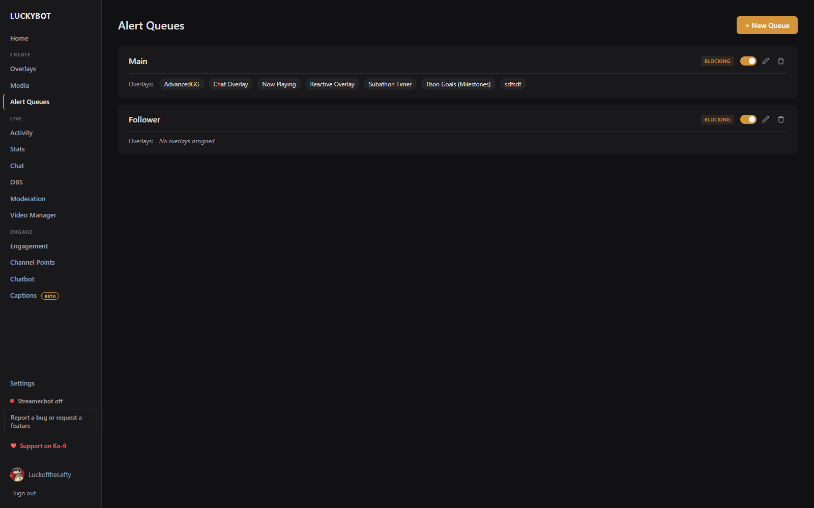

# Alert Queues

Alert queues control how alerts are played back. Without a queue, all alerts fire the moment their event comes in, which can cause them to stack or overlap. Queues let you manage the timing.

---

## Queue types

**Blocking**: alerts play one at a time. Each alert waits for the previous one to finish. Use this when alerts should play cleanly in sequence.

**Non-blocking**: alerts play immediately regardless of what else is playing. Use this for sound effects or anything that does not need to wait.

---

## Creating a queue

Go to **Alert Queues** in the sidebar and click **+ New Queue**. Give it a name. New queues start as blocking; click the badge on the card to switch type.

---

## Assigning overlays to a queue

Queues are assigned per overlay. On the Overlays page, each basic or advanced overlay card has a queue dropdown. Widgets, static, and reactive overlays do not queue, so the picker does not appear for them.

If an overlay has no queue assigned, its alerts play immediately without queuing.

---

## Per-alert queue behavior

Within a blocking queue, each alert chooses how it joins in its Alert Settings: **Queue** (wait in line), **Skip Queue** (play immediately), **Skip if Busy** (play only when idle), or **Replace Same** (replace a queued alert of the same type). See [Alerts and Variants](alerts-and-variants.md).

---

## Queue card controls

Each queue card shows the name, the blocking or non-blocking badge, and the assigned overlays.

- **Toggle blocking/non-blocking**: click the badge.
- **Rename**: click the pencil icon.
- **Delete**: click the trash icon and confirm. Overlays using the deleted queue fall back to no queue.

---

## Controlling playback

Pause, skip, clear, and mute controls live on the **Activity Feed** page: global controls that apply to every queue, and per-queue controls in the expandable Alert Queues panel. See [Activity Feed](activity-feed.md). The [Deck](alerts-and-variants.md#the-deck) offers the same pause, skip, and clear for one overlay's queue in a small always-on-top window.
