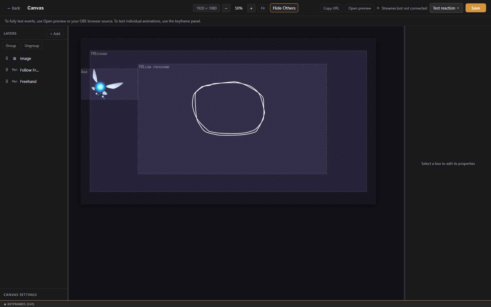

# Reactive Overlays

A reactive overlay is an always-on canvas that reacts to events. An idle animation loops whenever nothing is happening, and each event you add gets its own animation that plays once before the idle resumes. A mascot that bobs in place, waves on a follow, and jumps on a raid is a reactive overlay.

---

## Creating one

Click **+ New Overlay**, open the **Reactive** tab, pick **Reactive Overlay**, name it, and click **Create**. The overlay has a single canvas named **Canvas**; click it to open the editor.

Build the character from layers exactly as in the [Visual Editor](visual-editor.md): images, shapes, text, groups, and attachments all work. Paths and Follow path are especially useful here for movement.

---

## Idle and reactions

The **ANIMATION** bar above the keyframe timeline holds one chip per animation:

- **Idle**: the loop that plays whenever no reaction is playing. Its keyframes are the layers' normal keyframes and always loop.
- One chip per reaction, each named for its event (for example `Twitch.Follow`). A reaction plays once when that event happens, then idle resumes. Its x removes the reaction and its keyframes.

Click **+ Reaction** to add one. The event picker is the same one alerts use: native events, Streamer.bot events, and Cloud events. Click a reaction chip to edit its animation; the timeline then shows that reaction's keyframes per layer. A layer with no keyframes for a reaction holds its idle pose. End a reaction near the idle pose so the handoff reads clean, or let the transition blend do it (below).

**Copy animation** copies tracks from Idle or another reaction into the active reaction, for selected layers or all of them, so a variation starts from something that already moves.

---

## Motion without keyframes

Every layer in a reactive overlay has a **Motion** section at the top of its **Animation** tab. Each behavior is added on top of whatever keyframes the layer has, so a static sprite comes alive with no timeline at all:

- **Bob**: up and down. Height in pixels and a period.
- **Sway**: rocks side to side. Angle in degrees and a period.
- **Breathe**: a gentle scale pulse. Size in percent and a period.
- **Drift**: a slow wander in both directions. Range in pixels and a period.
- **Blink**: hides the layer for a moment every so often. Interval, jitter, and duration in milliseconds. Put it on an eyelid or an open-eyes layer.

Each layer gets its own phase, so two bobbing layers never move in lockstep. Motion keeps running through reactions and transitions. In the editor it shows while the timeline plays or a reaction is being tested; paused, layers sit at their authored pose so edits land where you expect.

---

## Rules: amounts, tiers, variety, priority

Every reaction chip has a small **rules** button. Rules are optional; a reaction with none plays for every event of its type, as before.

- **Amount**: a minimum, a maximum, or both. The amount is whatever the event carries: bits for a cheer, viewers for a raid, gifts for a gift bomb, months for a resub. Make `Cheer`, `Cheer 100+`, and `Cheer 1000+` reactions and the most specific one that fits plays.
- **Tier**: for sub events, Tier 1, 2, 3, or Prime.
- **Weight**: when several reactions share the same event and the same rules, one is picked at random by weight, and the one that just played is skipped when there is a choice. Three sub dances with weights 3, 1, and 1 give variety without repeats.
- **Priority**: higher priority reactions go ahead of anything already queued. When the queue is full, a higher priority arrival replaces the lowest priority entry.
- **Interrupt a playing reaction**: normally a reaction always finishes. With this on, the new reaction cuts in: the playing one exits from wherever it is through the transition blend, then the interrupter enters.

The chip's tooltip shows the rules in force.

---

## Sound and media per reaction

Audio, video, and GIF layers can start when a reaction plays. Select the layer while a reaction chip is active and the ANIMATION bar shows **Play (layer) on this reaction** with an offset in milliseconds and **stop when it ends**. The layer restarts that many milliseconds after the reaction begins (after the entry blend), at its trim start and volume. With the stop option, it pauses when the reaction ends or is cut. The layer's idle behavior (play once on load, or loop) is unchanged.

**Test reaction** in the editor plays the armed audio layers too, so the timing can be heard.

---

## Handoff settings

- **Interrupt idle**: off by default. Off, an event that lands mid-idle waits for the loop to finish its lap, so the reaction starts from the settled pose. On, the reaction starts right away.
- **Transition (ms)**: the blend into and out of every reaction (500 by default, 0 for a hard cut). The idle animation pauses during the reaction and resumes from the same point afterwards, so the character never jumps.
- **debug**: logs reaction matching, media cues, and text rendering to the overlay's browser console, for diagnosing why a reaction, a sound, or its text is not showing.

---

## How events are matched

An incoming event is matched against the reactions for its source and type, with rules applied as above. Matched reactions queue up to five deep and play in priority order, each with its own event data, so `{{user}}` in a text layer fills in during that reaction and goes blank on idle. Only a reaction marked **Interrupt** can cut a playing one.

Events arrive from the app's own Twitch connection first, with Streamer.bot as a fallback when configured. Duplicates are suppressed.

---

## Testing

**Test reaction** in the top bar lists this overlay's reactions. Fire one to play it once followed by a couple of seconds of idle, the same handoff the live overlay runs. Twitch reactions take a test amount (bits, viewers, gifts, or months), which is what the amount rules see. The **Test reaction** button in the ANIMATION bar does the same for the reaction being edited.

---

## In OBS

Add the overlay URL as a browser source like any other overlay. Reactive overlays are always on, so they do not use alert queues.
