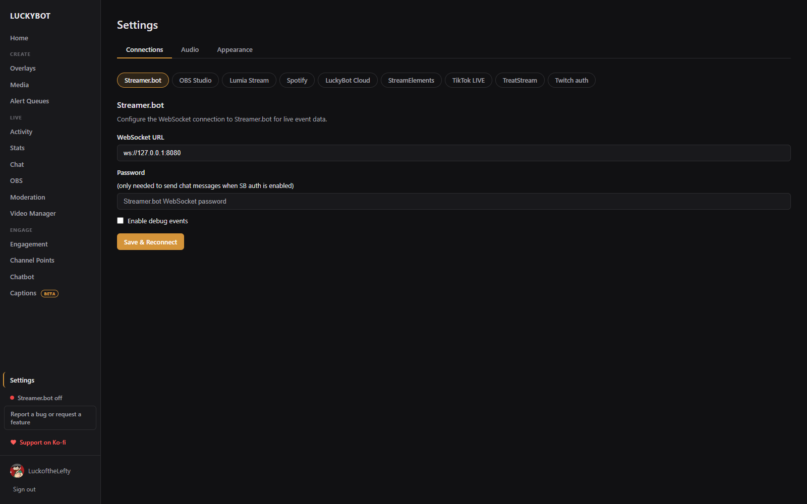
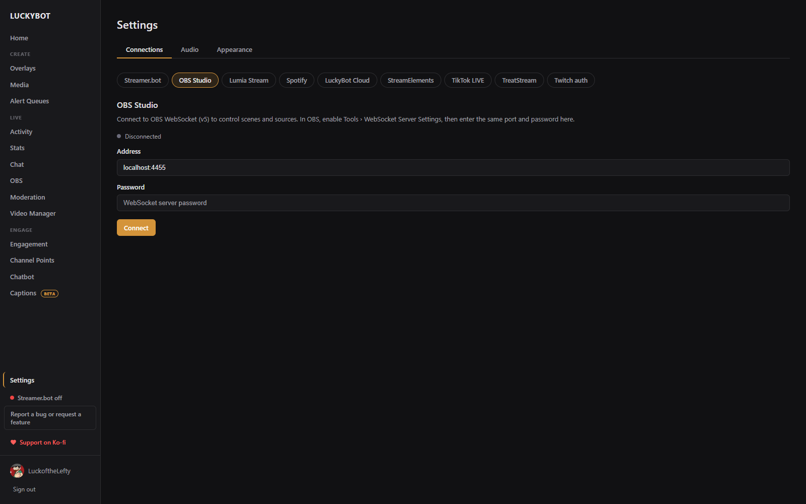
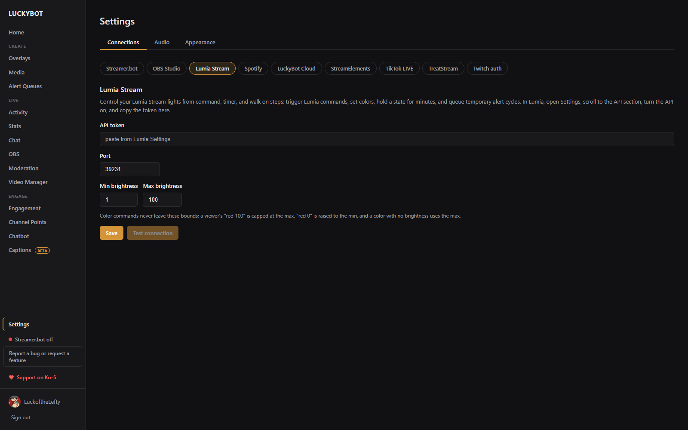
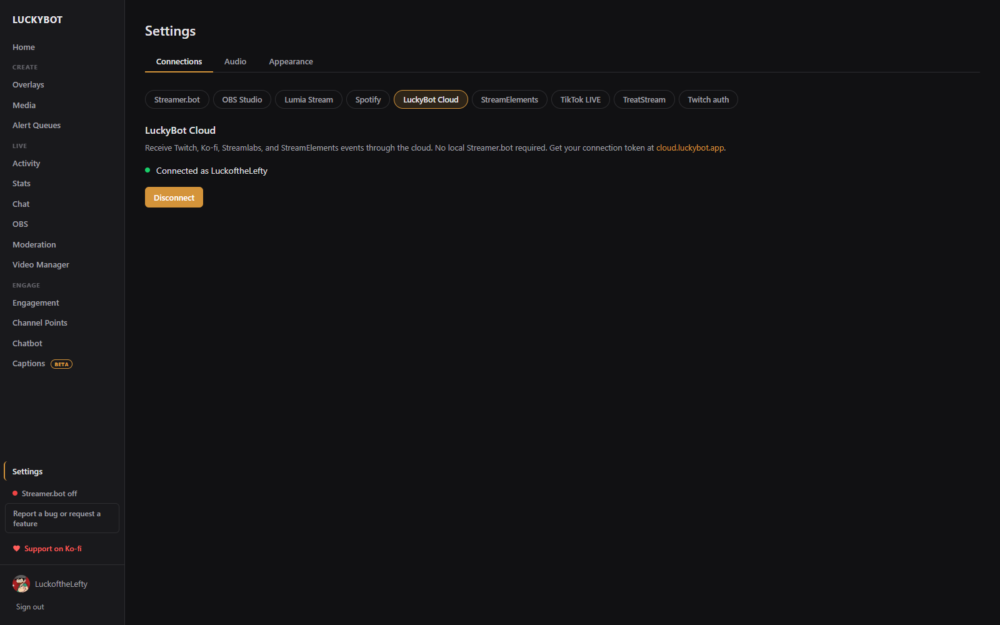
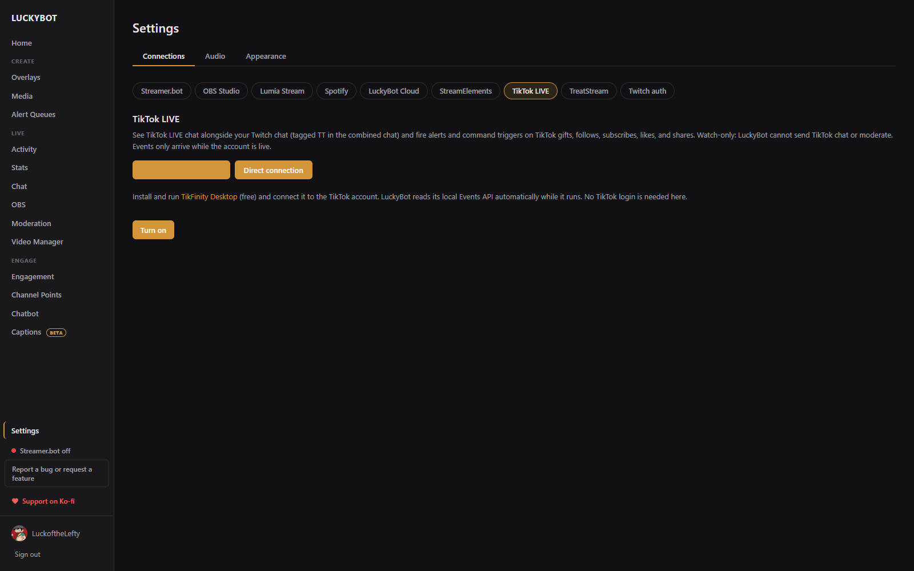
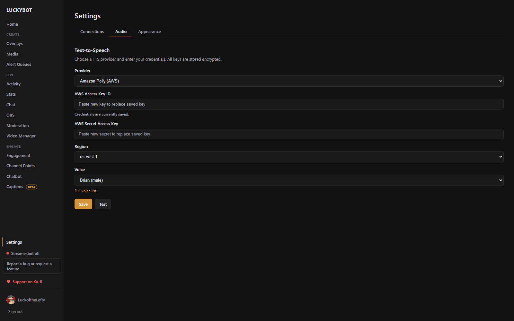
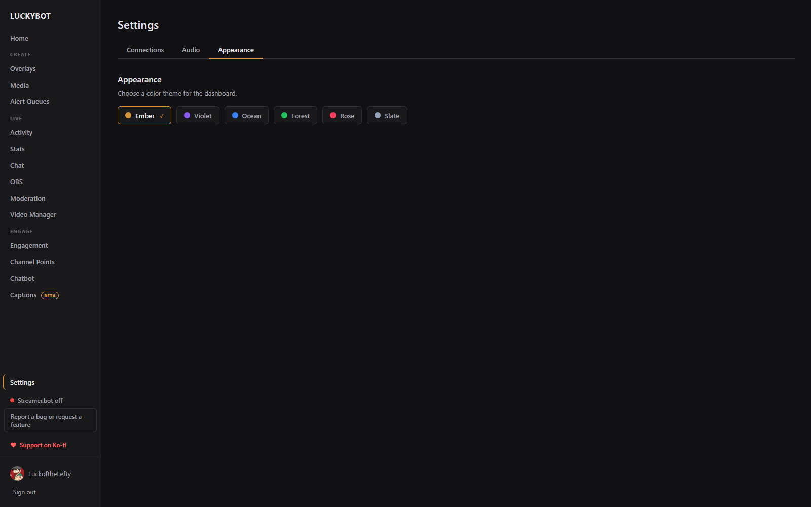

# Settings

The Settings page has four tabs: **Connections**, **Audio**, **Appearance**, and **System**. System only appears in the desktop app. LuckyBot remembers the tab you were on.

---

## Connections

Connections is a row of sub-tabs, one per service: Streamer.bot, OBS Studio, Lumia Stream, Spotify, LuckyBot Cloud, StreamElements, TikTok LIVE, TreatStream, and Twitch auth. None of them is required. LuckyBot talks to Twitch on its own with your login.

### Streamer.bot

Optional. Connecting a local Streamer.bot instance adds YouTube events and anything else your Streamer.bot connects to.

- **WebSocket URL**: the address LuckyBot connects to. The default is `ws://127.0.0.1:8080`. In Streamer.bot, enable the server under Servers/Clients > WebSocket Server.
- **Password**: only needed to send chat messages when Streamer.bot's WebSocket authentication is enabled.
- **Enable debug events**: shows Streamer.bot debug events in the activity feed. Off by default because they are noisy.

Click **Save & Reconnect** after making changes. The sidebar's Streamer.bot pill turns green when the connection is live.

### OBS Studio

Connect to OBS WebSocket (v5) for the OBS page (scenes, sources, audio mixer, stream and record controls) and for automatic recovery of LuckyBot browser sources.

1. In OBS, open **Tools > WebSocket Server Settings** and enable the server.
2. Enter the **Address** (default `localhost:4455`) and the server **Password**.
3. Click **Connect**.

The status line shows Disconnected, Connecting, or Connected. A wrong password reads "Authentication failed. Check password." Once connected, LuckyBot also watches its own browser sources in OBS: if one stops talking to the app for 30 seconds, LuckyBot asks OBS to refresh it, which recovers a crashed overlay page without you touching OBS.

### Lumia Stream

Control your Lumia Stream lights from command, timer, and walk on steps: trigger Lumia commands, set colors, hold a state for minutes, and queue temporary alert cycles.

In Lumia, open Settings, scroll to the API section, turn the API on, and copy the token.

- **API token**: paste the token from Lumia Settings.
- **Port**: default 39231.
- **Min brightness** and **Max brightness**: 1 to 100. Color commands never leave these bounds: a viewer's "red 100" is capped at the max, "red 0" is raised to the min, and a color with no brightness uses the max.

Click **Save**, then **Test connection**. A working setup reports the Lumia version it reached.

### Spotify

Lets chatbot commands control Spotify (play, pause, skip) and queue song requests with the Spotify step. Playback control needs Spotify Premium, and Spotify must be playing on a device.

Uses your own free Spotify app: create one at developer.spotify.com/dashboard, add `beacon://spotify-callback` as a Redirect URI, and paste its **Client ID** and **Client Secret** here, then click **Connect Spotify**. Your browser opens the Spotify authorization page; approve it and come back.

If a music overlay already has Spotify credentials saved, **Copy from my music overlay** reuses them. You still authorize once for playback control. This connection is separate from a music overlay's own Spotify connection (different permissions), though the same Spotify app works for both.

Once connected, **Test** reports what is playing, and **Disconnect** removes the connection.

### LuckyBot Cloud

Optional. [LuckyBot Cloud](https://cloud.luckybot.app) relays events from services that only speak webhooks or cloud sockets, such as Ko-fi, Streamlabs, StreamElements, Fourthwall, and custom WebSocket feeds, and includes a mobile companion for watching chat and events from your phone. It needs a subscription.

Paste your **Connection token** from cloud.luckybot.app, click **Validate** to confirm it and see which account it belongs to, then **Save & Connect**. Use the same Twitch account in LuckyBot and at cloud.luckybot.app, or the token is rejected.

When configured, the status line shows Connected, Connecting, Reconnecting, or an error such as "Subscription expired." **Disconnect** removes the saved token.

### StreamElements

Used by the StreamElements importer to read your StreamElements overlays and AlertBox so they can be brought into LuckyBot (see [Overlays](overlays.md#importing-from-streamelements)).

Get your JWT token at streamelements.com/dashboard/account/channels (click Show secrets, then copy the JWT Token), paste it into **JWT token**, and click **Connect**. The token is stored encrypted on this computer and only sent to StreamElements. The page then shows the channel it connected as.

### TikTok LIVE

See TikTok LIVE chat alongside your Twitch chat (tagged TT in the combined chat) and fire alerts and command triggers on TikTok gifts, follows, subscribes, likes, and shares. Watch only: LuckyBot cannot send TikTok chat or moderate. Events only arrive while the account is live.

Two ways to connect:

- **Through TikFinity (free)**, the default. Install and run TikFinity Desktop and connect it to the TikTok account. LuckyBot reads its local Events API automatically while it runs. No TikTok login is needed in LuckyBot. If you change the connected account in TikFinity, click **Reconnect**.
- **Direct connection**. Connects straight to TikTok without TikFinity. Enter the **TikTok username**. TikTok requires signed connections and the signing service (Euler Stream) charges for webcast signing, so this mode usually needs a paid **Euler Stream API key**.

Click **Turn on**. The status line shows Connected, Connecting, or Waiting, plus **Reconnect** and **Turn off** buttons.

### TreatStream

Connect TreatStream directly so treats arrive complete. Streamer.bot can relay them, but it forwards only part of each treat.

TreatStream needs an app of your own, the same way Spotify does. Open your TreatStream API settings, create an app with the redirect URL `beacon://treatstream-callback`, paste its **Client ID** and **Client Secret**, and click **Save app**. Then click **Connect TreatStream**, approve LuckyBot in the browser, and come back.

Once connected: **Send a test treat** fires a treat through the same path a real one takes (check the Activity feed), **Reconnect** re-opens the live socket, and **Disconnect** removes the connection.

### Twitch auth

LuckyBot uses your Twitch login for events, chat, and channel actions. Tokens refresh automatically every 15 minutes.

This section shows the refresh token status and expiry. **Refresh Auth Token** forces a refresh and logs each step, which helps when diagnosing a login problem. If no refresh token is stored, sign out and back in.

---

## Audio

Text-to-speech for alerts and the chatbot's Speak step. All keys are stored encrypted.

### Provider

Choose **ElevenLabs**, **Amazon Polly (AWS)**, or **TTS.Monster**.

- **ElevenLabs**: API Key and Voice ID. **Browse voices** opens the ElevenLabs voice library.
- **Amazon Polly**: AWS Access Key ID, Secret Access Key, Region, and a Voice picker grouped by language (the full Polly catalog; neural voices fall back to standard automatically where a region lacks them). **Full voice list** opens the AWS voice list.
- **TTS.Monster**: API Key and Voice ID. **Get an API key** and **Browse voices** open the TTS.Monster console.

### Output Device

If you have more than one audio output, a dropdown lets you choose which device TTS plays through. This only affects playback inside the app. OBS browser sources route audio through the OBS mixer regardless of this setting.

Click **Save** to apply changes, or **Test** to hear a short sample with the current settings.

---

## Appearance

Click a theme card to change the dashboard color theme: Ember (default), Violet, Ocean, Forest, Rose, or Slate. The change applies immediately.

---

## System

Desktop app only.

### Startup

- **Run LuckyBot at Windows startup**
- **Open Activity Feed window at startup**
- **Keep running in the background when the window closes**: closing the window hides LuckyBot to the tray and keeps counting subs, follows, and bits, and keeps the chatbot and overlays running. Quit fully from the tray icon. Pair it with "Run at Windows startup" so nothing is missed while your PC is on.
- **Ask for confirmation before closing LuckyBot**: on by default.

Chat windows can also open at startup per channel, under Chat > settings > Popouts & Overlays.

### App

- **Open data folder**: opens the folder that holds the database, logs, and backups.
- **Check for updates**: checks now. The app also checks on startup.
- **Download updates automatically**: new versions download in the background and install the next time you close LuckyBot. A banner still offers to restart sooner.
- **Export all overlays**: saves every overlay as a separate `.beacon` file.

### Privacy

Once a day LuckyBot sends your Twitch name, the app version, and how many overlays, commands, and timers you have. It never sends anything off your PC (real name, location, IP, email, files), your chat, your viewers, your keys, or what your commands and overlays say. **Let the developer know I use LuckyBot** turns this off.

### Diagnostics Logs

Export a ZIP of WebSocket and server logs for troubleshooting. Choose **Include logs from** (last 24 hours, 3 days, 7 days, or all available) and click **Export Logs ZIP**. The same bundle is attached automatically when you send a bug report from the sidebar.

### Backups

LuckyBot takes a database snapshot before each update and can take them on a schedule.

- **Automatic scheduled backups**: on by default. Pick **How often** (Daily, Weekly, Monthly, or Custom weekdays) and the time of day.
- **Skip while I'm live (back up after the stream)**: on by default.
- **Keep the last N backups**: 2 to 50, default 10.
- **Back up now**: takes a snapshot immediately. The local server restarts briefly to do it.

Each backup lists the app version and time it was taken. **Restore** rolls back to that snapshot and restarts the app. If that version's installer is not in the backup folder, you can still choose **Restore database only**.

---

## Sidebar extras

- **Workspace switcher**: appears under the logo when more than one workspace is available to you, for example one shared by another streamer. Switching reloads the dashboard for that workspace.
- **Streamer.bot pill**: green when connected, red "Streamer.bot off" otherwise. Click it to open this page.
- **Report a bug or request a feature**: opens a short form. Bug reports can include your recent logs (no passwords or tokens) and a screenshot, and go straight to the developer.
