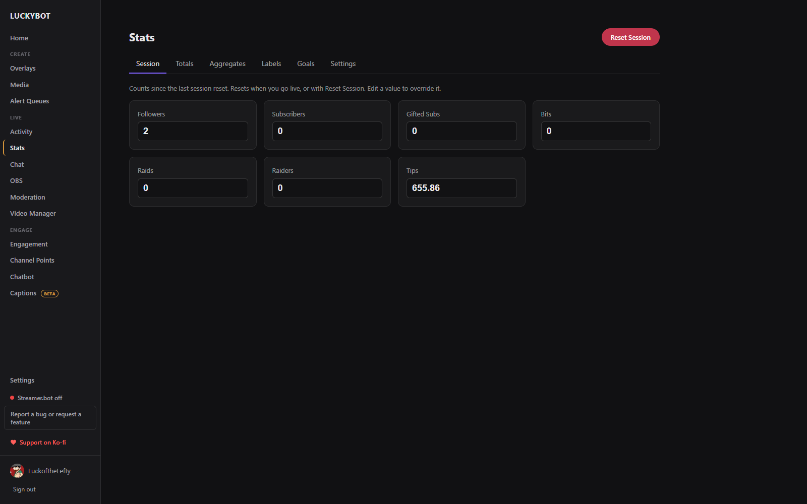
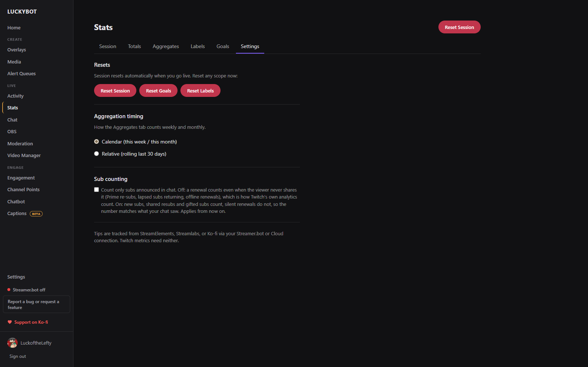
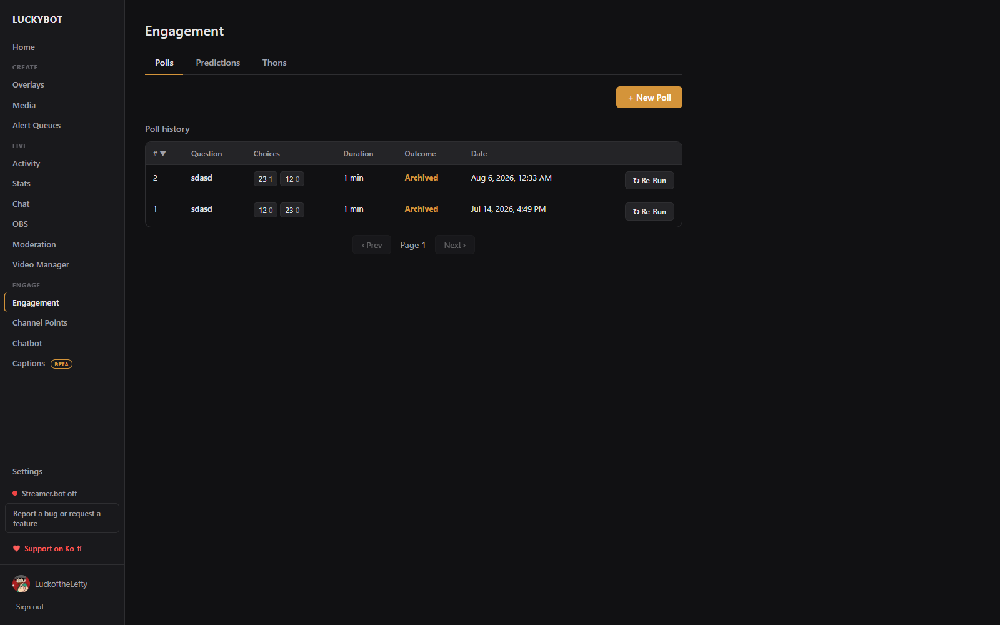
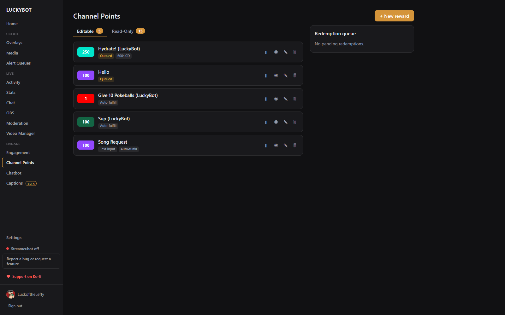
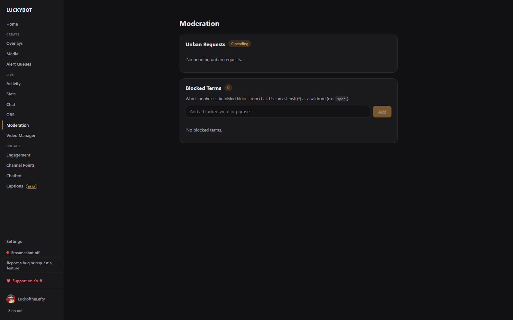
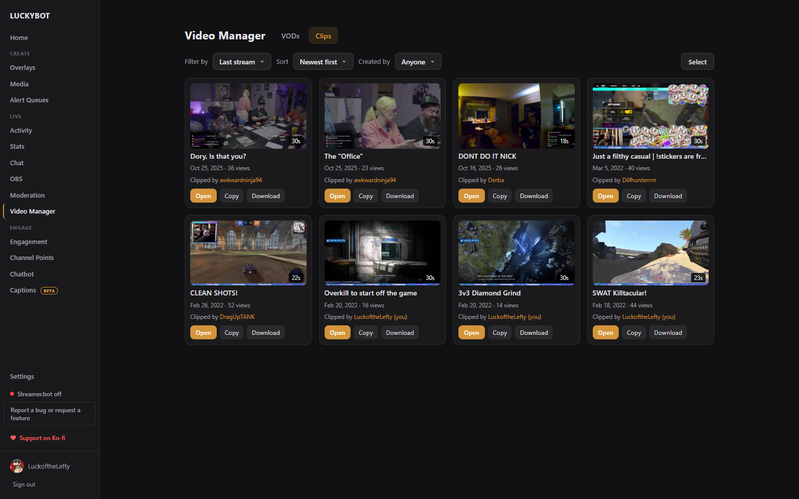
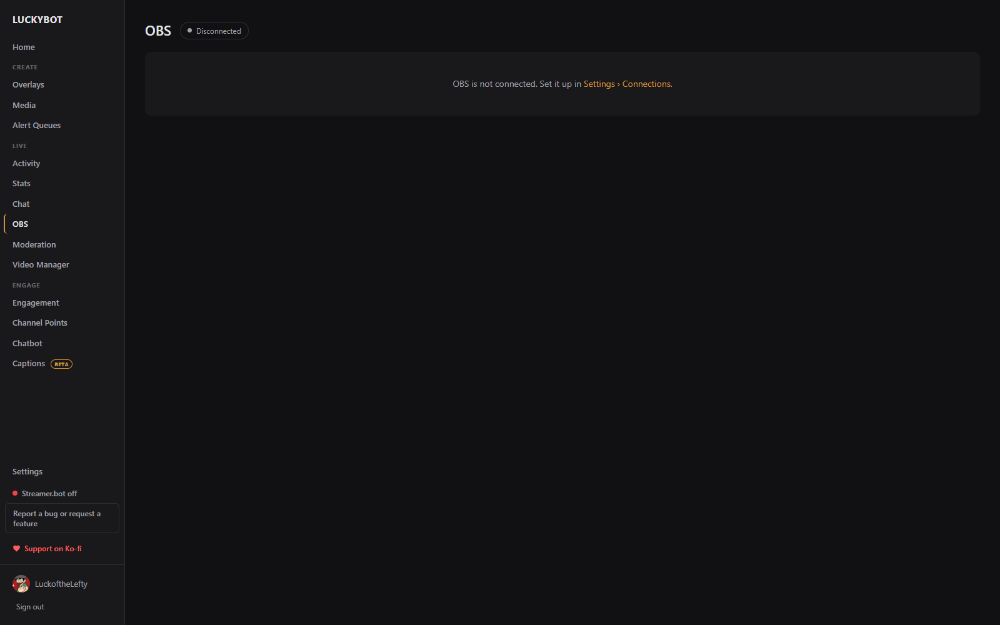
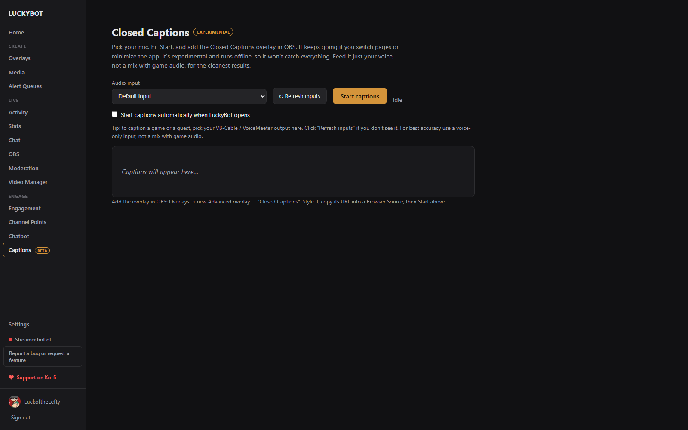

# Stream Tools

Beyond overlays and chat, LuckyBot manages the rest of the stream from dedicated pages in the sidebar.

---

## Home

The landing page. **Stream info** edits your title, category, and up to ten tags; picking a category saves to Twitch immediately, title and tags save with the Save button. Below it: the getting-started walkthrough, counts of your overlays and recent events, quick actions, your five most recent events, and chips for your overlays. A security banner appears here if an overlay page ever runs script outside LuckyBot's policy (see [Overlays](overlays.md#security-notice)).

---

## Stats

Live counts for followers, subscribers, gifted subs, bits, raids, raiders, and tips, across six tabs. Resubs are folded into subscribers.

- **Session**: counts for the current stream. Resets automatically when you go live, or manually with Reset Session. Every value is editable.
- **Totals**: all-time totals. Followers, subscribers, and bits come live from Twitch and are not editable; gifted subs, raids, raiders, and tips can be edited to seed a starting number.
- **Aggregates**: this week and this month (or a rolling 30 days), plus top cheerer, tipper, and gifter leaderboards and an editable all-time gifter board. An **All subs** card adds subscribers and gifted subs together.
- **Labels**: the latest and recent contributor per type (latest follower, latest sub, latest cheerer, tipper, raider). Edit to override what overlays show.
- **Goals**: a target and progress bar for followers, subs, bits, and tips, with a Reset Goals action.
- **Settings**: reset buttons; **Aggregation timing** (calendar week and month, or a rolling 30 days); **Hold weekly/monthly resets until the stream ends** for streams that cross a boundary; and **Sub counting**.

**Count only subs announced in chat** changes what a "sub" is. Off (default): a renewal counts even when the viewer never shares it, such as a Prime re-sub, a lapsed sub returning, or an offline renewal, which matches how Twitch's own analytics count. On: new subs, shared resubs, and gifted subs count, silent renewals do not, so your counters match what your chat saw. It applies from the moment you turn it on.

Click any count to edit it, for example to match another tracker. Everything here is available to widgets as live variables. See [Widgets](widgets.md).

---

## Engagement

Polls, predictions, and thons on one page.

- **Polls**: a question with two to five choices and a duration, a live results card while running, End Poll, and a sortable poll history with **Re-Run**.
- **Predictions**: a question with two to ten outcomes and a window, then **Lock**, **Pay out** the winning outcome, or **Cancel & refund**, with a history whose rows open a full result breakdown.
- **Thons**: subathons and point-a-thons. See [Thons](thons.md).

Live poll and prediction bars also appear on the Activity and Chat pages while one is running.

---

## Channel Points

Manage channel point rewards in two tabs:

- **Editable**: rewards created through LuckyBot: create, edit, pause, enable or disable, and delete them. A reward has a title, cost, color, prompt, optional text input, auto-fulfill, cooldown, and a per-stream limit.
- **Read-Only**: rewards created on Twitch or by another app. Twitch only lets an app manage rewards it created, so use **Copy to LuckyBot** to make an editable duplicate, then disable the original on Twitch.

A **Redemption queue** lists pending redemptions for editable rewards that are not auto-fulfilled, with Approve and Reject (refund) per item and Approve all and Reject all per reward.

---

## Moderation

- **Unban Requests**: review, approve, or deny pending unban requests. Updates live.
- **Blocked Terms**: manage the channel's AutoMod blocked term list. An asterisk works as a wildcard.

Day-to-day moderation (timeouts, bans, chat modes, Shield mode) lives on the [Chat](chat.md) page.

---

## Video Manager

Browse your VODs and clips.

- **VODs**: browse past broadcasts by date range and create clips from them. The clip editor shows the VOD timeline with your stream markers, a draggable 5 to 60 second window, and a preview; give the clip a title and create it.
- **Clips**: filter by range (last stream, 24 hours, 7 or 30 days, all time, custom) and creator, sort by date or views, open a clip with synced chat replay, copy its link, or download it. **Select** enables multi-select for downloading many clips to a folder at once. Deleting and retitling clips happens on Twitch; the page links straight to the Twitch clips manager.

---

## OBS

Connect OBS under **Settings > Connections > OBS Studio** (enable the WebSocket server in OBS first). The OBS page then gives you:

- **Go Live / Stop Stream** and **Record / Stop Rec** buttons with a status pill, each with a confirmation.
- A **scene switcher** with the live scene tagged.
- A **Sources** panel to toggle source visibility in the current scene.
- An **Audio Mixer** with per-input mute and volume, split into Visible and Hidden sources.

The same connection lets chatbot steps switch scenes, toggle sources and filters, and mute inputs, and lets LuckyBot refresh one of its own browser sources automatically if the page stops responding.

---

## Closed Captions

Live on-screen captions from a fully offline speech-to-text engine. No cloud service, nothing leaves your machine. This feature is marked experimental.

1. Add the **Closed Captions** overlay (Advanced tab of the New Overlay browser) to OBS and style it: font, colors, outline, position, line count, hold time, and a profanity filter.
2. On the Captions page, pick your microphone and click **Start captions**. The first start downloads the speech model (about 40 MB). Captions keep running if you switch pages or minimize the app.
3. A live preview shows what viewers see. An option starts captions automatically when LuckyBot opens.

Feed it just your voice, not a mix with game audio, for the cleanest results. To caption a guest or a game, pick a virtual audio cable as the input.
