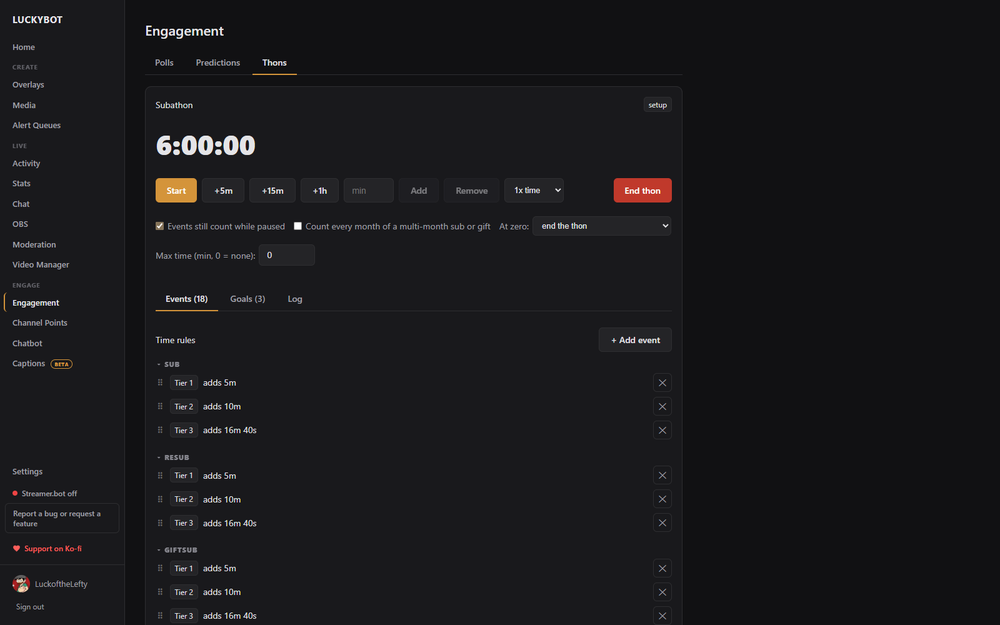
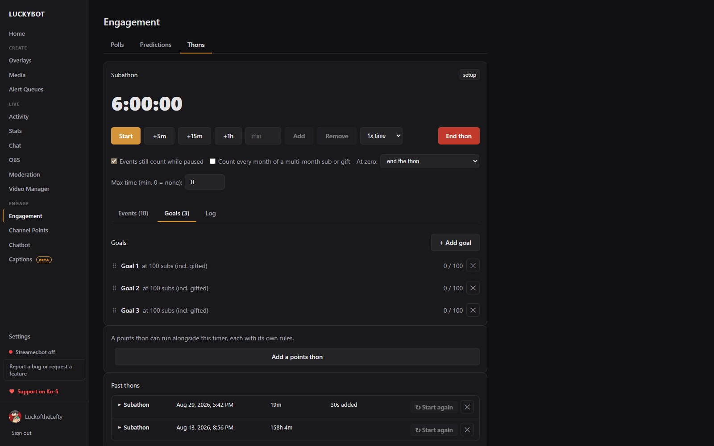

# Thons

A thon is a countdown your viewers extend (a subathon), or a points goal they fill: subs, gift bombs, bits, tips, raids, follows, or any other event add time or earn points by rules you set, with milestone goals along the way.

It all runs on the server, so OBS reloads and crashes never lose anything and pausing is exact. Two overlay templates put it on stream: **Subathon Timer** and **Thon Goals (Milestones)**, both under the Advanced tab of the New Overlay browser.

Thons live under **Engagement > Thons**.

---

## Setting one up

Click **Set up a thon**. The wizard asks a few plain-English questions.

1. Pick the kind: **Countdown timer** (a clock viewers extend) or **Points goal** (events earn points toward a target; goals along the way are milestones, and goals past the target are stretch goals). Name it and set the starting time or the points target.
2. Either **Use the basic template** or **Start from scratch**. The template offers one line per source, each with a checkbox:
   - **Subs / ReSubs / Gift Subs**: seconds (or points) per Tier 1, 2, and 3. Gift bombs follow the tier values per gifted sub inside the bomb, without double granting.
   - **Cheers**: an amount per 100 bits.
   - **Tips**: an amount per dollar, from Streamlabs, StreamElements, Ko-fi, and Fourthwall.
   - **Follows** and **Raids** (with a minimum viewer count for raids).
   - **Per-viewer bonus** on raids: an amount per viewer, capped.
   - **Count every month of a multi-month sub or gift**: off by default, so buying or gifting six months at once counts as one sub.
3. **Create the thon**. Everything lands as editable rules on the thon, and the thon starts in setup until you press **Start**.

One countdown timer and one points thon can run at the same time, each with its own rules.

---

## Running it

The active thon card is the remote control:

- **Start**, **Pause**, and **Resume**. Pausing is exact; the clock stops to the second.
- Quick adds: **+5m**, **+15m**, **+1h** (or +10, +50, +100 points), and a box to **Add** or **Remove** any amount.
- The multiplier select (**1x**, 1.5x, 2x, 3x) applies to every rule grant while set: a manual happy hour. A green chip shows an active boost and when it ends.
- **Events still count while paused**: on by default.
- **At zero**: end the thon, or stay at 0:00 so late subs revive it.
- **Max time**: a ceiling in minutes, 0 for none.
- **End thon**: click twice to confirm.

Totals chips show subs, gift subs, bits, tips, raid viewers, follows, and how much time viewers added in total.

---

## Events, Goals, and Log

### Events

The rules. Each rule names an event (with a tier filter for subs and an amount range for bits, raids, and tips) and either **adds** time, a fixed amount plus an amount per unit ("60 seconds per 100 bits", as a threshold or proportionally, with an optional cap), or **activates** a timed multiplier ("2x time for 30 minutes"). **+ Add event** adds a rule; drag to reorder; **Save rules** commits edits.

**Test an event** runs any event through the same pipeline as a real one. **Preview** reports what would happen without changing anything; **Fire for real** adds real time and shows on the overlay, and can be undone from the log.

### Goals

Milestones on the thon's running totals, or on single big moments (gifted subs at once, bits at once, raiders at once, hype train level). Hitting one can add time, turn on a timed multiplier, or both: "500 subs reached, 2x time for an hour." Each goal has a label that shows on the goals overlay and in the log. Drag to set the overlay's display order.

### Log

Every grant, with the event, the viewer, the amount, and the time it added. Anything can be undone from here while the thon runs, so the math is always checkable.

---

## Past thons

Finished thons stay in the table with their totals, goals hit, and top time contributors. **Start again** opens the wizard with that thon's rules and goals carried over, so a recurring subathon takes seconds to set up.

---

## On stream

- **Subathon Timer** overlay: the clock, with fly-ups for added time and who added it, a pulse on adds, a multiplier badge, a low-time color, and a paused label. Field settings cover the title, clock format, colors, font, and size.
- **Thon Goals (Milestones)** overlay: upcoming and completed goals with a progress bar on the current one, an unlock sound, and a choice of which thon and which metrics to show.

Both overlays follow the server, so refreshing the browser source shows the correct time and progress immediately. Thon events also feed [chatbot event triggers](chat-bot.md), so a command can announce each grant in chat.
