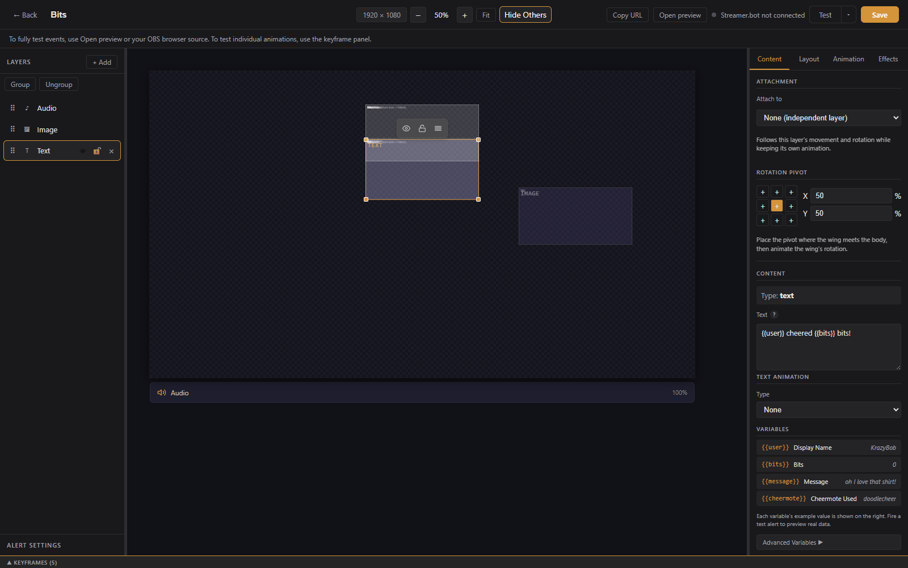
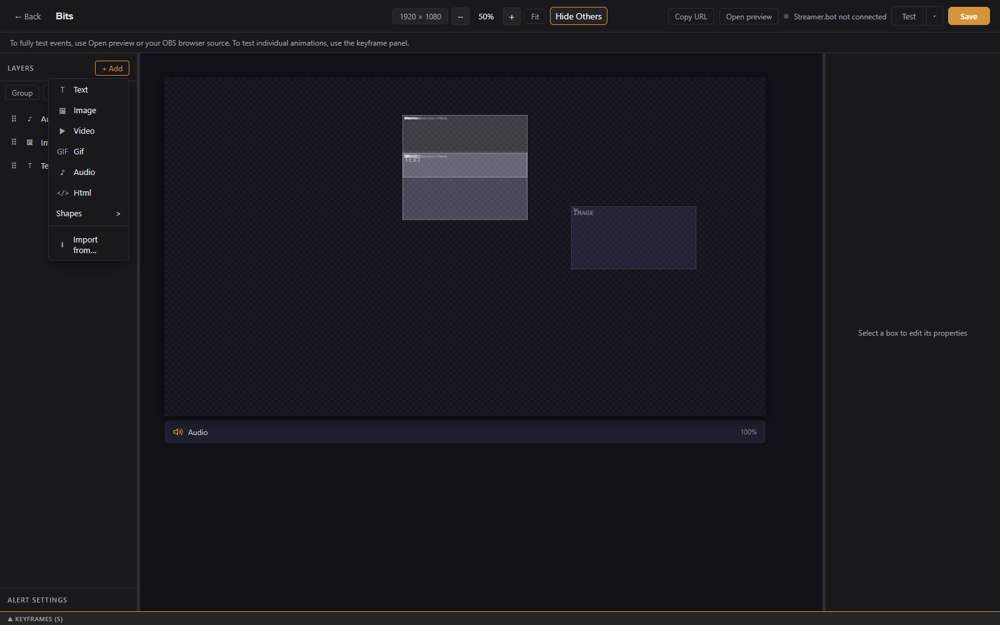
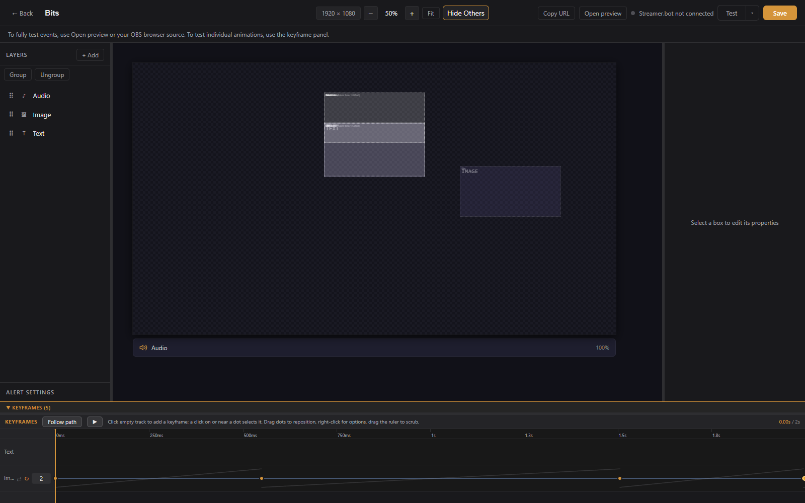

# Visual Editor

The visual editor is the main way to build alerts in a basic overlay, and the canvas for static, widget, and reactive overlays. It has the layers panel on the left, the canvas in the center, the properties panel on the right, the Alert Settings panel docked on the left edge, and the keyframe timeline along the bottom.

---

## Top bar

- **Back button**: returns to the overlay page.
- **Alert name**: click to edit inline. An Unsaved indicator appears when there are changes.
- **Canvas size**: presets (1080p, 1440p, 4K, 720p, Vertical) or a custom width and height.
- **Zoom**: minus and plus buttons, click the percentage to type a value, **Fit** to fit the canvas to the window.
- **Show Others / Hide Others**: toggles faint outlines of the other alerts in this overlay, for aligning elements across alerts.
- **Streamer.bot status**: a dot showing the Streamer.bot connection (when configured).
- **Copy URL** and **Open preview**: the overlay URL for OBS and a new-tab preview.
- **Variant Setup**: only when editing a variant; opens the condition builder.
- **Test**: plays the alert with sample data. The arrow next to it opens **Test with custom data**, where you edit the event payload first, and **Also fire on live overlays**, which sends the test to OBS too.
- **Save**: saves all changes. Ctrl+S also works.

Widget overlays replace Test with **Simulate** (follow, sub, gift bomb, cheer, raid, go live) and an **Advanced Widget Setup** button. Reactive overlays replace it with **Test reaction**. See [Widgets](widgets.md) and [Reactive Overlays](reactive-overlays.md).

---

## Layers panel

The layers panel lists every box on the canvas. Layers draw in order from bottom to top.

**+ Add** offers:

- **Text**: a text box, with `{{variable}}` placeholders from event data.
- **Image**: a static image from a URL or the media library.
- **Video**: a video file, plays during the alert.
- **Gif**: an animated GIF.
- **Audio**: an audio file, plays during the alert.
- **Html**: a block of your own HTML.
- **Shapes**: Rectangle, Ellipse, Line, Arrow, Polygon, Star, Custom path, and Freehand.
- **Import from**: copies every layer (position, size, settings, and media) from another alert or variant in the same overlay onto this canvas.
- **Label** (widget overlays): a styled text box already bound to a live stats variable. See [Widgets](widgets.md).
- **Progress** (widget overlays): a progress bar bound to a goal or counter.

Each layer row has a visibility toggle, a lock toggle, and a delete button. Double-click to rename. Drag to reorder. Click a layer to select it and edit its settings in the properties panel.

### Shapes

Shapes have a stroke color, width, and style (solid, dashed, dotted), a fill that can be solid or a linear or radial gradient with separate start and end opacity, and an optional glow. Polygons have a side count, stars have a point count and inner radius, arrows have head and shaft sizing, and rectangles have a corner radius.

**Custom path** and **Freehand** open the path editor first. Place points by clicking (or drag to draw freehand), hold Shift to snap angles, turn **Smooth curves** off for sharp corners, and check **Closed path** to join the ends. A path layer can hide its own line, which is useful when it only exists to guide motion (see Follow path below).

### Groups

Select two or more layers and click **Group**. Clicking any member then selects the whole group, dragging moves it together, and the shared handles scale every member at once. Alt-click selects a single member. **Ungroup** releases them where they are. Members keep their own keyframes and attachments.

### Attachments

In a layer's properties, **Attach to** makes it follow another layer's movement and rotation while keeping its own animation, such as a wing attached to a body. The **Rotation pivot** grid and X/Y percentages set the point a layer rotates around. Place the pivot where the wing meets the body, then animate the wing's rotation.

---

## Canvas

- Click a box to select it, drag to move, use the handles to resize.
- Arrow keys nudge 1px; Shift + arrows nudge 10px.
- Shift-click to select multiple boxes and move them together. With a selection, the Layers panel shows Group, Ungroup and Duplicate, plus an Arrange block: align to the selection or the canvas, and Space X / Space Y for equal gaps between three or more objects.
- Right-click a box (or a row in the Layers panel) for Duplicate, Hide, Lock, Bring to Front, Send to Back, and Delete.
- K toggles the keyframe panel; Ctrl+S saves.
- Ctrl+Z to undo, Ctrl+Y or Ctrl+Shift+Z to redo. Rapid moves merge into a single undo step.

---

## Properties panel

The properties panel has four tabs: **Content**, **Layout**, **Animation**, and **Effects**. Sections vary by layer type.

### Layout

- Position (X, Y), size, and z-order.
- Transform: rotation, flip, and skew, followed by the attachment and rotation pivot controls described above.
- **Visibility Condition**: show this layer only when a condition matches the incoming event. For example, a crown image only when `tier == 3000`.

### Animation

- Entrance and exit animation presets with direction, duration, and delay.
- **Enable Keyframe Animator** switches the layer to a custom timeline instead (see below).

### Effects

- Opacity, blend mode, color adjustments (brightness, contrast, saturation, hue, grayscale, sepia, invert, blur), and a tint overlay.

### Text layers (Content tab)

- **Content**: the text, with `{{fieldName}}` placeholders like `{{user}}`. An **Insert a variable** button opens a searchable picker; a common-variables list shows fields for the alert's event type.
- **Variable Style**: different size and weight for the variable portions of the text.
- **Typography**: font family (Google Fonts supported), size, weight, style, letter spacing, line height.
- **Alignment**: horizontal, vertical, padding.
- **Color**: text color, background, opacity.
- **Text Shadow**: offset, blur, and color.
- **Text Outline**: a letter stroke with width and color, for readable text on any background.
- **Box Border**: width, style, radius, and color.
- **Text Animation** lives in the Animation tab: marquee plus bounce, pulse, wave, wiggle and other per-letter effects, with an option to animate only the variable portions.

### Media layers

Image, GIF, video, and audio layers take a URL or a pick from the [media library](media-library.md). Audio layers also have a volume control.

---

## Keyframe animator

Enable the keyframe animator on a layer to animate position, size, rotation, and opacity along a custom timeline instead of entrance and exit presets.

The timeline panel at the bottom of the editor:

- Click the timeline to move the playhead and preview that moment; the canvas updates as you scrub.
- **Add Keyframe** captures the layer's current state at the playhead.
- Drag keyframes to retime them.
- Right-click a keyframe to pick its easing curve from grouped presets with curve previews.
- **Loop** repeats the keyframed animation, with an optional loop count and loop region.

A layer is animated by its keyframes once it has at least two. With the panel open and one layer selected, its motion path is drawn on the canvas and the keyframe dots can be dragged directly.

### Follow path

**Follow path** in the keyframe panel turns a drawn path into motion. Select one layer, pick a Custom path or Freehand layer, set the start and end time, and click **Apply motion**. LuckyBot writes position keyframes so the layer's pivot travels along the path. Options: **Rotate along path** so the layer faces its direction of travel, **Return to start** for a round trip, and **Flip horizontally on return** so a character faces forward both ways. The route uses the path's current position and shape, so apply it again after editing the path. Hide the path layer afterward if it was only a guide.
