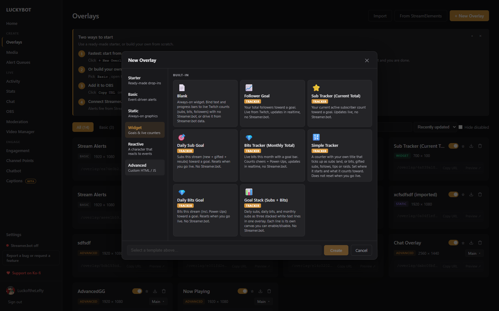

# Widgets

A widget is an always-on overlay that shows live numbers: goals, counters, totals, and labels. Widgets update in realtime with no other software, straight from your Twitch login.

---

## Ready-made widgets

The fastest start is the **Widget** tab in the New Overlay browser. It has prebuilt, fully styled widgets:

- **Follower Goal**: total followers toward a target.
- **Sub Tracker (Current Total)**: active subscriber count toward a goal.
- **Daily Sub Goal**: subs this stream, resets when you go live.
- **Bits Tracker (Monthly Total)** and **Daily Bits Goal**.
- **Simple Tracker**: one number, one label.
- **Goal Stack (Subs + Bits)**: three stacked goal lines in one overlay.

Pick one, name it, copy the URL into OBS, and it works. Open it in the editor to restyle anything.

---

## Showing any number

You do not need any setup to put a live number on screen. Add a text layer, click **Insert a variable** in its properties, and pick from the tabs:

- **Session**: counts for the current stream (followers, subs, gifted subs, resubs, cheers, raids, raiders, tips).
- **Totals**: all-time totals.
- **Aggregates**: weekly, monthly, and rolling 30-day counts.
- **Labels**: latest and recent contributors (latest follower, latest sub, and so on).
- **Goals**: goal targets and progress from the Stats page.
- **Leaderboards**: top cheerers, tippers, and gifters.
- **Chatbot Counters**: every counter from the [chatbot](chat-bot.md), like `{{counter_deaths}}`.

Faster still: **+ Add > Label** opens a searchable list of every live label and drops a styled text box already bound to the one you click. Check **Marquee** for lists that should scroll, like recent followers or top gifters.

The variable updates on the overlay the moment the underlying number changes. All of these numbers can be viewed and adjusted on the Stats page (see [Stream Tools](stream-tools.md#stats)).

---

## Goals and progress bars

To track a count toward a target with a progress bar, open **Advanced Widget Setup** from the editor's top bar and add a goal. Each goal reads as a sentence:

> Track [Subscribers] [this stream] toward a goal of [50]

- **Metrics**: Followers, Subscribers, Bits, Raids, Raiders.
- **Periods**: This stream, Weekly, Monthly, Every 30 days, All-time.
- The goal's variable name is generated automatically (for example `streamSubs`), with `{{streamSubs}}`, `{{streamSubsTarget}}`, and `{{streamSubsPct}}` tokens. A Rename button is there if you want your own name.
- **+ Add label & bar to canvas** drops a ready-made styled label and a bound progress bar in one click.

Progress bar layers bind to a goal through the Counter dropdown in their properties, and fill as the count approaches the target.

---

## Testing a widget

Widget editors have a **Simulate** menu instead of Test: Follow, Sub, Gift Sub, Gift Bomb, Resub, Cheer, Raid, and Go Live (which resets the session). A simulated event moves the widget for a few seconds so you can see it react, then the real numbers come back. Nothing is counted or saved.

---

## Counter widgets

Chatbot counters make great widgets. The quickest path is the **Create overlay** button next to a counter on the Chatbot page, which builds a styled counter widget in one click. See [Chatbot](chat-bot.md#counters).

---

## Streamer.bot-driven widgets

For advanced setups, a widget can be driven by Streamer.bot instead of native tracking: an action or Custom Event supplies the widget's variables, seeded on load, updated live, or both. The toggle is at the bottom of Advanced Widget Setup. Most widgets never need this.
